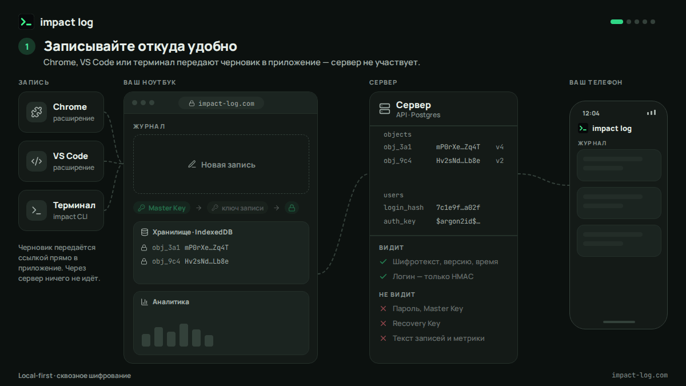

# impact-log

impact log — записывайте, что сделали и к чему это привело, — и получайте выжимку к перфоманс-ревью.

Local-first и сквозное шифрование: приложение работает без регистрации, записи шифруются прямо в браузере,
а аккаунт нужен только для синхронизации между устройствами — сервер видит лишь шифротекст.
Как это устроено — [docs/architecture.md](docs/architecture.md), решения — [docs/adr](docs/adr).



<sub>Путь записи через сервис. English version — [docs/media/data-journey-en.gif](docs/media/data-journey-en.gif).</sub>

Исходный код открыт намеренно: всё, что обещает страница «Принципы» (что хранит сервер, как шифруются данные,
что уходит в сеть), можно проверить здесь — схема БД в `apps/api/src/db/schema.ts`, криптография в
`packages/core/src/crypto`, хранилище в браузере в `apps/web/src/vault`.

## Структура

```
packages/core            — домен, аналитика, отчёт для ревью, экспорт, криптография (@impact-log/core/crypto)
packages/shared          — HTTP-контракты (zod), коды ошибок, тарифы (entitlements)
apps/web                 — PWA: Vue 3 + Vite + vue-router + vue-i18n + IndexedDB
apps/api                 — Fastify 5 + Drizzle ORM + Postgres: аутентификация, ключевые конверты, синхронизация
apps/cli                 — `impact add|git` — быстрый захват из терминала
apps/chrome-extension    — быстрый захват из браузера (Manifest V3)
apps/vscode-extension    — быстрый захват из редактора
infra/caddy              — Caddyfile (TLS, CSP, раздача SPA, прокси /api)
docs                     — ADR, архитектура, API, деплой, дизайн-система, PWA
```

## Локальная разработка

Нужны Node 24 (`.nvmrc`), pnpm (`corepack enable`) и Docker.

```bash
pnpm install
pnpm db:up        # Postgres в Docker на localhost:5432
pnpm dev          # api → http://localhost:3000, web → http://localhost:5173
```

Проверки (то же самое запускает CI):

```bash
pnpm check                          # Biome: линт + формат (pnpm format — автоисправление)
pnpm typecheck
pnpm --filter @impact-log/core test # тесты ядра и криптографии
pnpm build
```

End-to-end (нужен запущенный API с `TRUST_PROXY=true` и чистая БД):

```bash
pnpm --filter @impact-log/api e2e
cd apps/web && ../api/node_modules/.bin/tsx scripts/sync-e2e.ts   # два «устройства» против живого API
```

Клиенты захвата — см. README в `apps/cli`, `apps/chrome-extension`, `apps/vscode-extension`.

## Деплой

Push в `main` → GitHub Actions: проверки → сборка образов в GHCR → обновление на сервере.
Подготовка сервера и ручные операции — [docs/deploy.md](docs/deploy.md).

## Лицензия

[GNU AGPL-3.0](LICENSE) © 2026 Maxim Vishnevsky.

Если вы запускаете изменённую версию impact log как сервис, её пользователи должны иметь возможность получить
исходный код этой версии (раздел 13 лицензии) — в web-клиенте для этого есть ссылка «Исходный код» в подвале
и на странице «Принципы».
