# ADR-0005: Local-first и сквозное шифрование — целевая архитектура

- Статус: принят
- Дата: 2026-09-28 (исходный документ владельца — 2026-09-27, в оригинале статус
  «Proposed / baseline for greenfield implementation»)
- Автор: владелец (Максим)
- Производные ADR: [0006 — криптография](0006-crypto.md), [0007 — синхронизация](0007-sync.md),
  [0008 — аутентификация и устройства](0008-auth-devices.md), [0009 — entitlements](0009-entitlements.md),
  [0010 — протокол захвата](0010-capture-protocol.md), [0011 — готовность к регионам](0011-region-ready.md),
  [0012 — ротация Master Key](0012-key-rotation.md)
- Частично заменяет: [ADR-0001](0001-auth-model.md) (через ADR-0008)
- Обзор для разработчика: [docs/architecture.md](../architecture.md)

> **Как читать этот файл.** Ниже — русская шапка: краткое изложение, отличия реализации от документа
> и соответствие номеров follow-up ADR. Затем, после разделителя, — **полный текст ADR владельца на
> английском** без перевода, чтобы не исказить формулировки. Из правок только форма: Markdown-разметка,
> диаграммы перерисованы в mermaid (схемы данных и макет Recovery Kit — текстовыми блоками), название
> продукта приведено к написанию «impact log» (правило CLAUDE.md). Если текст ADR расходится с кодом,
> источник правды о *текущем* поведении — код и производные ADR-0006…0011, о *целевом* — этот документ.

## Кратко

- Продукт **local-first**: клиент владеет доменной моделью, открытым текстом и вычислениями (аналитика,
  отчёты, экспорт). Первая запись создаётся без регистрации.
- Сервер — **непрозрачное хранилище и синхронизация** зашифрованных объектов плюс аутентификация,
  устройства, ключевые конверты и тарифы. Открытый текст записей серверу не нужен ни для одной функции.
- Все поля записи (заголовок, описание, оценка, категории, метки, метрики, дата) шифруются вместе;
  сервер не индексирует доменные поля.
- **Иерархия ключей:** случайный Master Key (MK) не зависит от пароля; каждый объект шифруется своим
  DEK, DEK обёрнут MK; MK обёрнут конвертами (пароль / Recovery Key / устройство). Смена пароля не
  перешифровывает данные, ротация MK — это переобёртка DEK.
- **Recovery Key** — высокоэнтропийный офлайн-ключ, единственный путь восстановить хранилище без
  доверенных устройств. Скрытого «админского» ключа нет: потеряны все устройства, пароль и Recovery
  Key — данные потеряны.
- Синхронизация — оптимистичная конкурентность на уровне объекта (`objectId` + `baseVersion`), без CRDT;
  конфликты разрешает клиент, потому что только он может расшифровать обе ветки.
- Безопасность, восстановление, экспорт и доступ к своим данным **никогда не за пейволом**. Тарифы —
  через entitlements с первого дня; в пилоте у всех профиль PILOT без ограничений.
- Захват (Web, Chrome, CLI, VS Code) производит единый версионированный `ImpactDraft`.
- Архитектура готова к регионам: Account ID не кодирует регион, клиенты резолвят endpoint.
- AI опционален и появится позже; детерминированная аналитика никогда не делегируется LLM.

## Отличия реализации от документа

Состояние на 2026-09-29 (переход на local-first + E2EE, два раунда усиления безопасности, ротация MK).
Подробности и обоснования — в производных ADR.

| # | Тема | В документе | В реализации | Подробнее |
| --- | --- | --- | --- | --- |
| 1 | UI-стек | «UI / React» на схеме §4 | Vue 3 + Vite, composables без Pinia | ADR-0002 |
| 2 | Идентификатор для входа | Непрозрачный Account ID; восстановление по «Account ID + Recovery Key», Account ID — в Recovery Kit (§7.2) | Логин (никнейм, ADR-0001) остаётся идентификатором входа, восстановления и резолвинга региона; дополнительно у аккаунта есть непрозрачный `accountId` (12 символов Crockford Base32, 60 бит). Recovery Kit содержит логин, а не Account ID | ADR-0008, ADR-0011 |
| 3 | Пароль на сервере | Не специфицировано | Пароль не уходит на сервер: Argon2id → HKDF даёт KEK (остаётся на клиенте) и `authKey` (уходит вместо пароля) | ADR-0006, ADR-0008 |
| 4 | Резервные коды 2FA | Отдельный механизм с отдельным жизненным циклом, если появится (§7.2) | Резервные коды ADR-0001 **удалены**. Recovery Key + ещё один фактор: код 2FA (новый пароль) или пароль (новая 2FA); без второго фактора — только через 48 ч с предупреждением на вошедших устройствах, после чего 2FA можно один раз перевыпустить без текущего кода | ADR-0008 |
| 5 | KDF для Recovery Key | Memory-hard KDF «such as Argon2id where appropriate» | HKDF-SHA256 (160 бит случайной энтропии — memory-hard KDF не нужен); идентификатор `hkdf-sha256` в конверте | ADR-0006 |
| 6 | Ключ устройства | Пара ключей на устройство, публичный ключ и device-конверт MK на сервере, разблокировка платформенной аутентификацией, QR-сопряжение (Stage 4) | Симметричный неэкспортируемый AES-256-GCM `CryptoKey` в IndexedDB; device-конверт хранится **только локально**; хранилище на известном устройстве открывается автоматически, без пароля и без WebAuthn; QR-сопряжения нет. Новое устройство подключается паролем + TOTP или Recovery Key. На сервере устройство подтверждается не ключом, а `deviceSecret` (32 байта, в БД — SHA-256) | ADR-0006, ADR-0008 |
| 7 | Recovery-конверт до синхронизации | Stage 2: recovery-секрет и конверт создаются вместе с локальным хранилищем | Локальное хранилище без аккаунта имеет только device-конверт; пароль и Recovery Key появляются при подключении синхронизации (регистрации, вместе с новым MK аккаунта). До этого страховка — экспорт | ADR-0006 |
| 8 | Хранение конфликтов | «Retain both ciphertext branches» (§8, Stage 3) | Сервер хранит одну (последнюю) версию объекта; при конфликте возвращает серверную ветку, а локальная ветка и копия серверной хранятся на клиенте (IndexedDB `conflicts`) до разрешения | ADR-0007 |
| 9 | Компакция tombstone'ов | Tombstone живёт, пока его не увидят все устройства / до политики хранения | Tombstone'ы хранятся бессрочно, компакции нет; в лимит `maxObjects` они не входят. Tombstone можно создать только для объекта, который есть на сервере | ADR-0007 |
| 10 | Сильный отзыв устройства | Ротация MK + переобёртка DEK для оставшихся устройств | Ротация MK **есть**, но не переобёрткой, а полной перешифровкой: новый MK, каждый живой объект шифруется заново свежим DEK (DEK прежней эпохи знает отозванное устройство), новый Recovery Key, пароль прежний. Шифротексты копятся в серверном черновике и подменяют объекты одним атомарным commit; эпоха ключа (`keyEpoch`) у аккаунта и объектов, устаревший шифротекст → `STALE_KEY`; остальные устройства разлогиниваются и перешифровывают хранилище при входе. `rewrapObject` остаётся для перехода локального хранилища на MK аккаунта | ADR-0012, ADR-0006, ADR-0008 |
| 11 | Ключи клиентов захвата | Каждый клиент захвата — отдельное устройство со своим конвертом; CLI — keychain, VS Code — SecretStorage | Клиенты захвата **не держат ключей и не ходят в API**: собирают `ImpactDraft` и передают его в web-клиент через фрагмент URL `/capture#draft=…`; шифрует web-клиент после подтверждения пользователем | ADR-0010 |
| 12 | Схема Impact / ImpactDraft | Схемы §7 и §11.1 | Добавлены `evidence?: Evidence[]` в Impact и `occurredAt?` в ImpactDraft; `impactScore` — целое 1–5 | ADR-0010 |
| 13 | Entitlements: аудит | Изменения entitlements «auditable/versioned» | Профили версионированы (`revision`, `effectiveFrom`), но смена тарифа — просто `users.plan`, истории изменений нет | ADR-0009 |
| 14 | Серверное применение лимитов | Квоты, защищающие ресурсы, — и на сервере | На сервере при push применяются `maxActiveImpacts` и новые лимиты хранилища `maxStorageBytes` / `maxObjects` (ограничивается только рост). `maxDevices`, `maxAttachmentBytes` и capabilities — пока только информация для клиента | ADR-0009 |
| 14a | PILOT | «Unrestricted»: в пилоте не применяется ни один обычный продуктовый лимит (§11.2) | Без продуктовых лимитов, но с потолком хранилища против злоупотреблений: 512 МиБ шифротекста и 100 000 строк объектов на аккаунт, плюс лимит частоты синхронизации (`SYNC_RATE_LIMIT_MAX`, 120 запросов в минуту) | ADR-0007, ADR-0009 |
| 14b | Квота и удаление | Квота не должна зависеть от «создано за всё время» (§11.2, Quota semantics) | Соответствует: `maxActiveImpacts` и `maxObjects` считают только живые объекты, удаление освобождает место | ADR-0009 |
| 15 | Резолвинг региона | `resolve(accountId)`; клиенты не хардкодят API | `POST /api/region/resolve` принимает **логин**; web-клиент пока ходит на same-origin `/api`; код `WRONG_REGION` объявлен, но сервером не возвращается | ADR-0011 |
| 16 | homeRegion | Хранится у аккаунта, назначается при создании | Колонки нет: регион — конфигурация инстанса (`REGION`, по умолчанию `ru-1`) | ADR-0011 |
| 17 | Нумерация follow-up ADR | ADR-002 … ADR-010 | ADR-0006 … ADR-0011 (таблица ниже) | — |
| 18 | Сверх документа (усиление) | — | Сверка аккаунта в каждом запросе синхронизации (`X-Impact-Account`, `409 ACCOUNT_MISMATCH`); лимиты частоты по паре «логин + IP» и по пользователю, IPv6 — по /64; блокировка перебора TOTP на пользователя; TOFU и клиентский потолок параметров KDF; явный выбор перед переносом локальных записей в другой аккаунт; атомарная смена MK с карантином нерасшифровываемых объектов; логи без SQL-параметров | ADR-0006, ADR-0007, ADR-0008 |

Не реализовано и по документу может подождать: вложения (есть только `AttachmentRef` в схеме как точка
расширения), локальный и облачный AI, голосовой захват, второй регион и миграция, биллинг.

## Соответствие follow-up ADR

| В документе (§15) | У нас | Состояние |
| --- | --- | --- |
| ADR-002 — криптопримитивы, конверты, KDF, формат Recovery Key, тест-векторы | [ADR-0006](0006-crypto.md) | принят |
| ADR-003 — офлайн-синхронизация, конфликты, tombstone'ы | [ADR-0007](0007-sync.md) | принят |
| ADR-004 — аутентификация и подключение устройств без почты | [ADR-0008](0008-auth-devices.md) | принят |
| ADR-005 — entitlements и биллинг | [ADR-0009](0009-entitlements.md) | принят (биллинг — позже) |
| ADR-006 — локальный AI | — | не начат |
| ADR-007 — облачный AI | — | не начат |
| ADR-008 — формат вложений, чанки, докачка, GC | — | не начат |
| ADR-009 — Capture Protocol и подключение клиентов | [ADR-0010](0010-capture-protocol.md) | принят |
| ADR-010 — региональные data plane и миграция | [ADR-0011](0011-region-ready.md) | только «regional-ready»; миграция — позже |
| — (ротация MK: §3, §7.2 «rotate MK and re-wrap DEKs», §11.3 «Optional key rotation») | [ADR-0012](0012-key-rotation.md) | принят (решение владельца 2026-09-29) |

---

## Original ADR (owner, 2026-09-27)

> Далее — текст владельца без изменений по существу.

**Status:** Proposed / baseline for greenfield implementation | **Date:** 2026-09-27

**Scope:** Architecture and feature rollout from local-only MVP to encrypted multi-device sync,
monetization, analytics and optional AI. Attachments (images, audio, documents) are treated as
first-class encrypted artifacts.

## 1. Context

impact log is a personal work-impact journal. A user records an accomplishment, gives it an impact score,
assigns labels/categories and then largely forgets about it. At performance-review time the application
aggregates the accumulated history into statistics and an exportable review report.

The content can contain confidential employer information. The service therefore should minimize what the
backend can learn, while preserving low-friction capture, offline use, multi-device access, paid plans and
useful analytics.

## 2. Decision

Build the product local-first. The client owns the domain model, plaintext and computation. The backend is
designed as an opaque encrypted-object synchronization/storage service plus authentication,
device/key-envelope management and commercial entitlements. Content analytics and report generation are
client-side. Cloud AI, if introduced, is an explicit opt-in boundary rather than a prerequisite for the
product.

## 3. Architectural invariants

- Plaintext impact content is never required by the backend for core product functionality.
- Impact fields (title, description, score, categories, labels, metrics and occurrence date) are encrypted
  together; the server does not index domain fields.
- Security/privacy features are not paywalled: local storage, E2EE once sync exists, recovery and
  user-owned export remain available independent of plan.
- Subscription expiry never makes existing user data inaccessible. Free-limit enforcement blocks creation
  above the limit; read/edit/delete/export remain available.
- Analytics calculations that can be deterministic are implemented as deterministic client code, not
  delegated to an LLM.
- The encryption master key is independent from the password. Password changes must not require
  re-encrypting all user data.
- Device revocation and key rotation are supported by key wrapping; data objects are encrypted with DEKs
  rather than directly with a long-lived master key.
- AI is optional. Local AI stays inside the client trust boundary; cloud AI requires an explicit user
  action and clear disclosure.
- Binary artifacts are first-class encrypted objects. Original files, derived thumbnails/previews,
  filenames, MIME types, captions and other sensitive attachment metadata are encrypted client-side; the
  backend stores opaque blobs and only the minimum metadata required for transfer/sync.

## 4. Target logical architecture

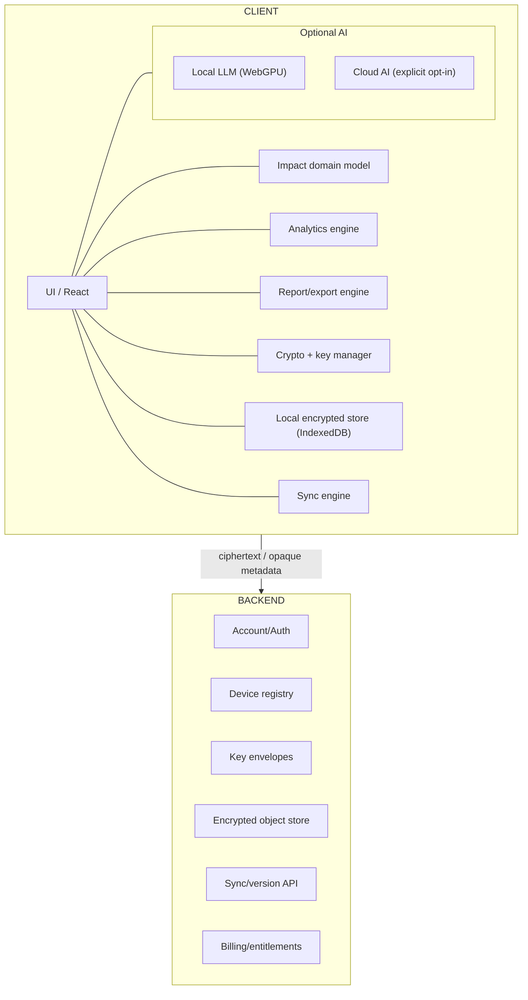

The backend does not need title, text, labels, categories, impact score, metrics, report contents or
encryption keys.

## 5. Staged rollout

### Stage 0 — Domain-first foundation

Build before product features become expensive to change.

- Define Impact as a client-side domain object with a stable random objectId and schemaVersion.
- Separate domain objects from persistence DTOs. UI must not depend directly on IndexedDB/server
  representation.
- Implement deterministic analytics as pure functions over `Impact[]`.
- Implement export from the same normalized domain data.
- Introduce a storage interface (ImpactRepository) so local persistence and later sync are
  interchangeable.

**Constraint:** Do not add accounts, backend search, server-side analytics or plaintext domain columns.

### Stage 1 — Local-only MVP

Validate capture → habit → review value with zero backend dependency.

- Immediate onboarding: open app and create the first impact; no registration required.
- Persist locally in IndexedDB. Prefer encrypted-at-rest local vault if key UX is ready; otherwise keep
  repository boundary so encryption can be inserted without domain changes.
- Support create/edit/delete, categories, labels, score, date and optional measurable outcomes.
- Free product: up to 15 active impacts; existing entries always remain
  readable/editable/deletable/exportable.
- Basic deterministic analytics and a non-AI review/export flow.

**Constraint:** Success criterion: the product is useful for one review cycle without accounts, sync or AI.

### Stage 2 — Local vault and cryptographic model

Establish the key hierarchy before cloud sync exists.

- Generate a random Master Key (MK); never derive the data key directly from the password.
- Encrypt each object with a random Data Encryption Key (DEK); wrap DEKs under MK.
- Derive a Key Encryption Key (KEK) from the user's password using a memory-hard KDF; use it only to
  wrap/unwrap MK.
- Generate a recovery secret and a separate recovery envelope for MK.
- Keep decrypted domain state in memory only while the vault is unlocked; persist ciphertext locally.

**Constraint:** This stage makes the later server an opaque replication target rather than a trusted
database.

### Stage 3 — Account + encrypted sync

Add cloud value without giving the server content access.

- Create an opaque account identifier. Email is not required by the core architecture.
- Upload encrypted objects, versions/tombstones and key envelopes only.
- Server API performs optimistic concurrency using objectId + version/baseVersion.
- Different-object edits merge automatically. Same-object concurrent edits create a conflict; both
  ciphertext versions are retained until a client decrypts and resolves them.
- Backups contain ciphertext and opaque metadata only.

**Constraint:** The server becomes sync/storage, not the source of plaintext business truth.

### Stage 4 — Seamless multi-device

Make E2EE usable enough that users do not experience it as a cryptography product.

- Each device creates its own key pair. Device private keys remain in OS/browser-protected local storage
  where available.
- Store one MK envelope per authorized device.
- Allow new-device enrollment by password/recovery secret and by QR pairing from an already trusted
  device.
- Trusted devices unlock with platform authentication where available; avoid repeated password prompts.
- Expose a device list and revoke action. Document that revocation cannot erase keys/data already copied
  to a stolen device.
- For strong revocation, rotate MK and re-wrap DEKs for remaining devices; do not re-encrypt all content
  blobs.

**Constraint:** Do not introduce CRDT initially. impact log's append-heavy workflow is adequately served by
object-level optimistic concurrency.

### Stage 5 — Monetization / entitlements

Entitlement architecture exists before this stage. Stage 5 activates real plan assignment, quotas and
billing; during the pilot all accounts resolve to unrestricted PILOT entitlements.

Monetize accumulated value without holding data hostage.

- Free: maximum 15 active impacts, basic analytics, access to all existing data and export.
- Pro: creation beyond the free limit plus richer analytics/reporting; exact price and feature bundle are
  experiments.
- Plan/entitlement state is server-visible commercial metadata and is deliberately separate from encrypted
  content.
- For synced accounts, enforce creation quota server-side as well as client-side. Do not trust only client
  feature flags.
- Subscription expiry: no new impacts above the free limit; old impacts remain read/edit/delete/export
  capable.

**Constraint:** Keep E2EE/recovery/export out of the premium gate.

### Stage 6 — Advanced analytics and review builder

Turn accumulated records into the product's main payoff.

- Calculate counts, percentages, category distribution, score distribution, trends and period comparisons
  deterministically on the client.
- Build review-period filtering and report templates locally.
- Never ask an LLM to calculate authoritative percentages or totals.
- Advanced analytics can be a Pro entitlement while the underlying encrypted data model remains unchanged.

**Constraint:** This is the primary monetizable value layer; storage quantity is only a conversion trigger.

### Stage 6.5 — Encrypted attachments and evidence

Add evidence artifacts without changing the server trust boundary. The abstraction should exist early,
while user-facing attachment support can ship after the core review workflow.

- Introduce Attachment as a domain reference owned by an Impact; support image, audio, document and
  generic binary kinds.
- Encrypt each attachment with its own random File DEK. Wrap the File DEK through the same vault key
  hierarchy used for Impact objects.
- Store large ciphertext in dedicated object/blob storage rather than the structured sync database.
- Encrypt filenames, MIME type, captions, original timestamps and other sensitive metadata where they are
  not technically required by the transport layer.
- For large files, use authenticated chunked encryption and resumable upload; do not buffer an entire
  large plaintext file in browser memory.
- Generate thumbnails, resized images, waveform data and metadata stripping on the client before
  encryption. Derived artifacts are encrypted independently.
- Treat server-side OCR, transcription, thumbnailing, content indexing and virus/content inspection as
  unavailable for E2EE blobs unless the user explicitly crosses a separate processing boundary.
- Support attachment deletion/tombstones and garbage collection independently from the parent Impact
  lifecycle.

**Constraint:** Attachment support must not require plaintext file content or human-readable filenames on
the backend.

#### Voice capture extension

A later low-friction capture flow may record audio in-browser, transcribe locally, derive a structured
Impact draft, let the user review/edit it, then encrypt and persist the Impact. The original audio may
either be discarded or retained as an encrypted attachment according to the user's choice.

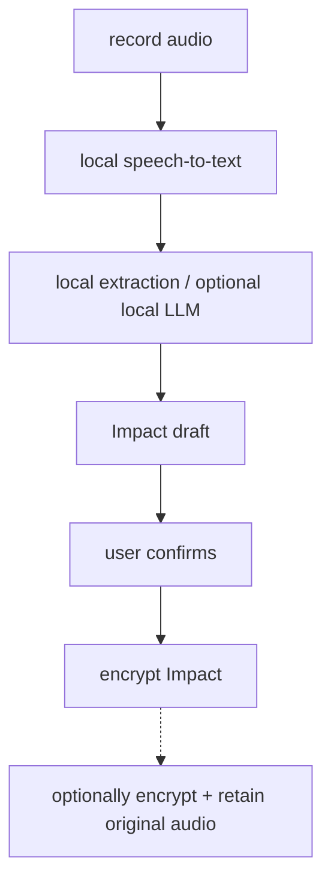

### Stage 7 — Local AI

Add narrative generation without moving the trust boundary.

- Offer local model download as an explicit opt-in because model weights can be large.
- Run inference in-browser using WebGPU-capable runtime; detect capability and degrade gracefully.
- Preprocess locally: filter review period, aggregate deterministic metrics and select relevant impacts
  before prompting.
- Use the LLM for synthesis, phrasing, grouping and narrative — not arithmetic.
- Cache model weights locally; never require local AI for core reporting.

**Constraint:** Start with small instruct models and measure quality/performance before increasing model
size.

### Stage 8 — Optional cloud AI

Provide a quality/speed fallback while keeping disclosure explicit.

- User explicitly selects records/period and initiates cloud processing.
- Decrypt only on the client; send the minimum selected/processed context required for the requested
  generation.
- Clearly distinguish Local AI from Cloud AI in the UI.
- Prefer architectures where the product backend does not persist AI plaintext. Exact
  provider/token-broker design is a separate ADR.
- Treat cloud AI as a new privacy/compliance boundary and review it separately before launch.

**Constraint:** Do not silently fall back from local AI to cloud AI.

## 6. Core data model

| Entity | Server-visible | Notes |
| --- | --- | --- |
| Account | opaque accountId, plan, subscription state | No domain content required. |
| Device | deviceId, public key, status | Private key remains on device. |
| KeyEnvelope | wrapped key bytes, envelope type/version | Password/recovery/device envelopes; no plaintext MK. |
| EncryptedObject | accountId, objectId, version, ciphertext, sync metadata | Plaintext Impact exists only after client unlock. |
| Tombstone | objectId, deletion version | Needed for offline deletion propagation. |
| AttachmentBlob | accountId, blobId, ciphertext size, transfer/sync metadata | Original/derived binary content and sensitive metadata are encrypted; large blobs live in object storage. |

## 7. Client-side Impact schema

```text
Impact {
  objectId: UUID
  schemaVersion: number
  occurredAt: date
  title: string
  description?: string
  impactScore: number
  categories: string[]
  labels: string[]
  metrics?: Metric[]
  attachments?: AttachmentRef[]
  createdAt: timestamp
  updatedAt: timestamp
}
```

The entire serialized Impact payload is encrypted. Only synchronization metadata that is strictly
necessary should remain outside the ciphertext. Whether timestamps can/should be hidden is a later
metadata-minimization decision.

### 7.1 Attachment / blob model

```text
AttachmentRef {
  attachmentId: UUID
  blobId: UUID
  kind: image | audio | document | binary
  encryptedMetadata: ciphertext
}

Encrypted metadata may contain:
  filename, mimeType, caption, originalSize,
  createdAt, dimensions/duration and derived-artifact refs.

Blob storage receives ciphertext only.
```

### 7.2 Recovery Key protocol

Recovery is cryptographic recovery of the vault, not a conventional server-side password reset. A user
who loses every trusted device must still be able to recover the Master Key (MK) using a high-entropy
Recovery Key stored offline. The server must never receive the Recovery Key, derived Recovery KEK or
plaintext MK.

**Recovery Key vs 2FA recovery codes.** The vault Recovery Key is a long-lived master recovery credential
capable of unwrapping MK. It is not a short OTP and not a list of one-time MFA bypass codes. If the product
later supports MFA recovery codes, those are a separate authentication mechanism with a separate
lifecycle.

#### Entropy and generation

- Generate the Recovery Key exclusively with a cryptographically secure random number generator on the
  client.
- Target at least 128 bits of uniformly random entropy. Prefer 128–160 bits for the human-transcribed
  printable format; do not derive it from words chosen by the user.
- Do not use a 6–8 digit code, UUID, timestamp, email-derived value or other low-entropy identifier as the
  recovery secret.
- Encode random bytes using an unambiguous human-readable alphabet. Exclude visually confusing characters
  where practical (for example O/0 and I/l/1).
- Group the encoded secret into short blocks for transcription and printing. Separators are presentation
  only and are removed before decoding.
- Add an integrity/checksum component so common transcription errors can be detected before attempting
  key derivation. The checksum does not add secret entropy.

**Illustrative format (not a final wire format):**
`ILRK1-V7KF-9Q2M-XC4P-8DWR-L6NH-Y3TJ-B5ZA-K2FE-<checksum>`.

The exact alphabet, byte layout, version prefix and checksum algorithm must be frozen in ADR-002 and
covered by test vectors before production. The displayed example is intentionally illustrative; security
comes from random bits, not from the visual length of the string.

#### Recovery envelope

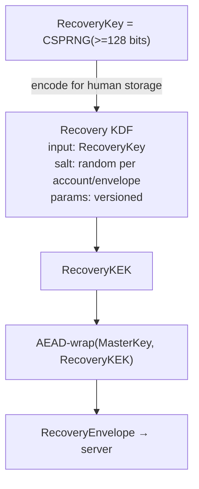

Server stores:

- envelope version
- KDF identifier + parameters
- salt
- nonce
- wrapped MK / authentication tag

Server never stores:

- RecoveryKey
- RecoveryKEK
- plaintext MK

Use a standard memory-hard password KDF such as Argon2id where appropriate for the chosen runtime and
recovery format, with parameters benchmarked against supported client devices. KDF identifiers and
parameters are stored in the envelope and versioned so they can be upgraded. Exact cryptographic primitive
choices and parameters belong to ADR-002 and must follow reviewed libraries/standards rather than custom
cryptography.

#### Disaster recovery on a new device

1. User enters/imports Account ID and Recovery Key on the new client.
2. Client downloads the RecoveryEnvelope and encrypted vault metadata/ciphertext.
3. Client validates/decodes the Recovery Key locally and derives RecoveryKEK using the envelope's
   versioned KDF parameters.
4. Client authenticates and unwraps MK locally. Failure reveals only that recovery material is invalid; no
   key is sent to the server.
5. Client unwraps object/file DEKs and can decrypt Impact records and attachments.
6. User establishes a new password/authentication credential and the client creates a fresh password
   envelope around the existing MK.
7. New device key pair is generated and a new device envelope is created.
8. Previously lost devices are revoked. If compromise is plausible, rotate MK and re-wrap DEKs for
   remaining devices rather than re-encrypting all large blobs.

#### Recovery Kit UX

When encrypted sync is enabled, require the user to acknowledge recovery setup. Offer both printable and
downloadable Recovery Kit forms. The kit should contain the Account ID, Recovery Key, format/version
information and a clear warning that possession of the kit can enable vault access.

```text
impact log — RECOVERY KIT

Account ID:
7F82-KL92-PA71

Recovery Key:
ILRK1-V7KF-9Q2M-XC4P-8DWR-
L6NH-Y3TJ-B5ZA-K2FE-...

Created:
2026-09-27

Keep this document private.
Anyone with this recovery material may be able to access
your encrypted impact log.

If all trusted devices and this Recovery Key are lost,
impact log cannot decrypt or restore the vault.
```

#### Loss, compromise and rotation

- Lost devices + valid Recovery Key: recoverable.
- Forgotten password + valid Recovery Key: recoverable; create a new password envelope without bulk data
  re-encryption.
- Lost Recovery Key + at least one trusted device: generate a new Recovery Key and RecoveryEnvelope from
  the trusted device, then invalidate the old envelope.
- Suspected Recovery Key compromise: rotate the recovery credential immediately; if the attacker may
  already have obtained MK/data, also rotate MK and re-wrap DEKs.
- Lost all trusted devices + lost Recovery Key + no other valid cryptographic recovery path: data is
  intentionally unrecoverable by the service operator.
- Never implement a hidden support/admin master key as a fallback; it would invalidate the zero-knowledge
  security model.

#### Abuse resistance

- Recovery endpoints should be rate-limited and monitored for abuse even though the cryptographic secret
  is high entropy.
- Do not log submitted Recovery Keys, passwords, derived keys or decrypted envelope contents.
- Account enumeration should be minimized; API responses should avoid unnecessary disclosure about whether
  a target account exists.
- Treat Recovery Kit export/print as a sensitive UI action and avoid exposing the secret to analytics,
  error reporting or DOM capture tooling.

## 8. Sync semantics

- Local write commits first; network sync is asynchronous.
- Objects are independently versioned. A write includes the client's baseVersion.
- If server version equals baseVersion, accept next version.
- If versions diverge, retain both ciphertext branches and return a conflict marker.
- Conflict resolution happens on a client because only a client can decrypt both branches.
- Deletion is represented by a versioned tombstone until all relevant devices have observed it / retention
  policy allows compaction.

## 9. Security/key hierarchy

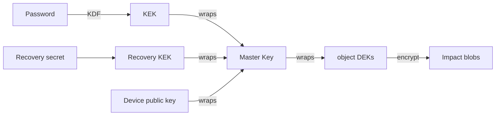

Cryptographic primitives, KDF parameters, browser key-storage behavior, envelope format and rotation
protocol must be specified in a dedicated security ADR before implementation. Do not invent custom
cryptography.

## 10. Explicitly rejected alternatives

- **Traditional server-first CRUD:** Makes the backend a plaintext data processor, complicates privacy
  and makes later E2EE a major migration.
- **Encrypt only the description:** Leaks categories, labels, impact scores and other potentially
  sensitive work metadata.
- **Derive the data encryption key directly from password:** Makes password rotation/recovery expensive
  and couples authentication UX to bulk data encryption.
- **Server-side analytics:** Requires plaintext or searchable leakage; unnecessary because the dataset is
  small and user-scoped.
- **LLM-first analytics:** Non-deterministic, expensive and inappropriate for authoritative
  totals/percentages.
- **CRDT from day one:** Complexity is not justified by an append-heavy personal log with rare same-object
  concurrent edits.
- **Mandatory account before first impact:** Adds onboarding friction and backend cost before the user has
  experienced value.
- **Plaintext object storage for attachments:** Would undermine the zero-knowledge boundary even if
  textual Impact fields remained encrypted.

## 11. Consequences

### Positive

- Low-friction local-first onboarding and offline operation.
- Backend breach exposes substantially less useful content if cryptographic implementation is sound.
- Server/storage implementation can evolve independently from the Impact domain.
- Analytics and exports remain fast and inexpensive because computation is user-local.
- Privacy becomes a credible product property rather than only a policy statement.
- Free local-only users can have near-zero infrastructure cost.

### Negative / cost

- Key recovery, device enrollment and revocation become core product engineering problems.
- Lost password + lost recovery material + no trusted device can mean permanent data loss.
- Server-side search, moderation, support inspection and ad-hoc database fixes are intentionally
  unavailable.
- Browser storage limits, device compatibility and local-AI performance require capability-aware UX.
- Metadata still exists (account/object counts, sizes, sync timing, network metadata). E2EE does not mean
  perfect anonymity.

## 11.1 Capture ecosystem

impact log is not designed as a single web form. The vault is the destination; capture should be available
in the developer's existing workflow. The supported client ecosystem is intentionally limited to Web/PWA,
Chrome Extension, CLI and VS Code Extension. Telegram and a desktop application/localhost daemon are
explicitly out of scope for this ADR.

### impact log Core

Core product behavior should be implemented as reusable TypeScript packages rather than duplicated inside
each UI. The Core is a logical/shared-code boundary, not a continuously running desktop process.

```text
impact log Core
├─ domain
│  ├─ Impact
│  ├─ ImpactDraft
│  ├─ Evidence
│  └─ AttachmentRef
├─ validation / schema migration
├─ analytics
├─ report/export
├─ crypto primitives + envelope formats
├─ sync protocol/client
└─ capture protocol
```

### Capture Protocol

All capture surfaces produce the same versioned ImpactDraft contract. A draft represents a proposed impact
before final validation/enrichment. This prevents Chrome/CLI/VS Code integrations from inventing
incompatible domain representations.

```text
ImpactDraft {
  schemaVersion: number
  draftId: UUID

  title?: string
  description?: string
  impactScore?: number
  categories?: string[]
  labels?: string[]
  metrics?: Metric[]
  evidence?: Evidence[]
  attachments?: AttachmentRef[]

  source?: {
    type: "web" | "chrome" | "cli" | "vscode"
    uri?: string
    externalRef?: string
  }
}
```

- Capture Protocol is versioned independently from UI implementations.
- ImpactDraft is not yet authoritative history; the client may validate, enrich or ask the user to confirm
  it before committing an Impact.
- Evidence references (URL, PR, issue, commit, branch, selected text metadata) are distinct from the
  narrative description.
- Integrations should capture user-selected evidence, not silently mirror all developer activity. The
  product tracks impact, not raw activity.

### Supported capture clients

**Web / PWA**

- Canonical product client and first implementation.
- Owns local vault UX, analytics, reports, recovery, device management and encrypted sync.
- Supports manual text/voice/file capture and remains fully usable without other integrations.

**Chrome Extension**

- Quick capture from GitHub, GitLab, Jira, Confluence, Grafana and arbitrary web pages without building
  provider-specific OAuth integrations first.
- Supports browser action, context-menu capture, selected text, current URL/title and optional
  page-specific adapters.
- Must never scrape/send an entire page by default; capture is explicit and user initiated.

**CLI**

- Optimized for terminal-first developer workflows: `impact add`, scripted draft creation and optional
  evidence from commits/branches/URLs.
- Supports interactive and non-interactive modes.
- Machine-readable output and stable exit codes allow personal automation without making automatic
  activity ingestion the default.

**VS Code Extension**

- Command Palette / quick-pick capture inside the editor.
- Can attach current repository, branch, commit, selected text or user-provided evidence after explicit
  action.
- Uses the same ImpactDraft schema and shared Core packages where runtime constraints permit.

### Key ownership without a desktop agent

Because no desktop application/localhost daemon is planned, there is no single local process that can hold
the Master Key for all capture clients. Therefore each installed capture client that writes directly to
the encrypted vault is treated as its own authorized device/client instance.

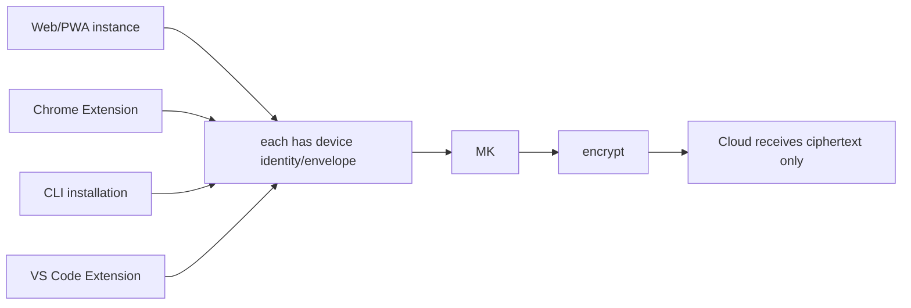

- Do not copy a raw MK between extension storage, CLI config files and VS Code settings.
- Enroll each client using the existing device/recovery pairing protocol and create a client-specific key
  envelope.
- Use the strongest platform secret storage available: browser extension storage must be threat-modeled
  separately; CLI should use OS keychain/credential facilities when available; VS Code should use
  SecretStorage rather than ordinary settings.
- If a runtime cannot safely retain an unlock capability, require explicit unlock/pairing rather than
  weakening the vault globally.
- Revocation is per client instance. Losing a CLI laptop or browser profile must not require deleting the
  whole account.

### Capture-to-vault flow

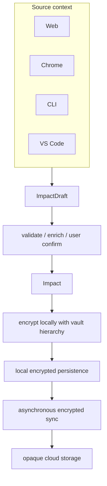

### Integration rollout

**Capture Phase A:** Web/PWA only. Stabilize ImpactDraft and Impact schemas against real personal usage.

**Capture Phase B:** Chrome Extension. Validate one-click capture from existing work tools and explicit
evidence collection.

**Capture Phase C:** CLI. Add terminal-first capture and personal scripting.

**Capture Phase D:** VS Code Extension. Add editor-native quick capture after protocol/key enrollment is
stable.

### Explicit non-goals

- No Telegram bot/integration.
- No desktop application, background daemon or localhost API at this stage.
- No automatic import of all commits, pull requests, Jira issues or browser history.
- No provider-specific server-side integrations until manual/explicit capture proves insufficient.
- No requirement for every capture client to expose full analytics/reporting UI; capture surfaces may
  remain intentionally small.

## 11.2 Monetization and entitlements

Monetization is an architectural concern from the beginning, but billing is not part of the pilot. The
system must support plan/feature limits without coupling commercial policy to encrypted content or
requiring a later rewrite of sync, clients or domain logic.

### Decision: entitlements-first, billing-later

All product capabilities that may eventually differ by plan are expressed through a versioned
entitlement/capability model. During the pilot every account receives an unrestricted Pilot entitlement.
No payment provider is required and no normal product limit is enforced.

```text
Pilot account
  ↓
plan = PILOT
  ↓
Entitlements
├─ canCreateImpact = true
├─ maxActiveImpacts = unlimited
├─ encryptedSync = enabled
├─ multiDevice = enabled
├─ attachments = enabled
├─ advancedAnalytics = enabled
├─ reviewBuilder = enabled
├─ chromeCapture = enabled
├─ cliCapture = enabled
└─ vscodeCapture = enabled
```

### Entitlement model

```text
Account
  accountId
  commercialState
  entitlementProfile

EntitlementProfile
  planId
  revision
  effectiveFrom
  limits
  capabilities

Limits
  maxActiveImpacts?: number | unlimited
  maxAttachmentBytes?: number | unlimited
  maxDevices?: number | unlimited

Capabilities
  advancedAnalytics: boolean
  reviewBuilder: boolean
  localAI: boolean
  cloudAI?: boolean
  chromeCapture: boolean
  cliCapture: boolean
  vscodeCapture: boolean
```

This is a conceptual model, not a commitment that every listed capability will become paid. Security and
data-sovereignty capabilities must not be used as monetization levers.

- E2EE, recovery, data export and access to already-created data are never disabled because of plan state.
- The backend may enforce quotas using opaque counters/metadata, but must not decrypt Impact content to
  determine entitlement.
- Clients consume resolved entitlements from a common contract; Web, Chrome, CLI and VS Code must not
  hard-code plan policy independently.
- UI checks are for UX only. Any quota that protects paid server resources or plan limits must also be
  enforced server-side.
- Entitlement changes must be auditable/versioned so a future billing integration can map provider events
  to product capabilities without changing encrypted data.

### Pilot behavior

For the pilot, account creation automatically assigns the PILOT entitlement profile. PILOT behaves as an
unrestricted account. The entitlement resolution path is nevertheless used in production code so that
monetization is exercised architecturally even while all limits resolve to unlimited.

- Do not scatter `if (pilot)` branches through product code. Pilot is just another entitlement profile.
- Do not introduce fake client-side limits merely to test monetization. Test entitlement boundaries with
  automated tests and non-production profiles.
- Existing pilot data remains readable/editable/exportable when commercial plans are introduced.
- Before pilot accounts are migrated to a future Free/Pro model, define an explicit migration policy rather
  than silently restricting users.

### Future Free / Pro activation

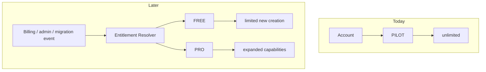

Existing encrypted data remains accessible in both cases.

The currently considered Free model may limit the number of active Impact entries (for example, a
configurable threshold), while Pro can expand limits and advanced analytics/review tooling. Exact prices,
thresholds and paid feature boundaries are product experiments, not architectural constants.

### Quota semantics

- A quota limits creation of new resources; it does not lock existing encrypted resources.
- If maxActiveImpacts is reached, the user can still read, edit, delete and export existing Impacts.
- Deleting an active Impact may free capacity if the future product policy uses an active-object quota.
- Do not base entitlement on lifetimeCreatedCount; that would punish deletion and make the free tier
  progressively unusable.
- Quota counters must tolerate offline clients and sync races. The authoritative server check occurs when
  a new encrypted object is accepted for sync; conflict/error semantics must be defined before limits are
  enabled.

### Billing boundary

A future billing provider is an external commercial system, not part of the encrypted content model.
Billing events update commercial state; an Entitlement Resolver converts that state into product
capabilities. Impact ciphertext, keys and decrypted analytics never need to flow through the billing
provider.

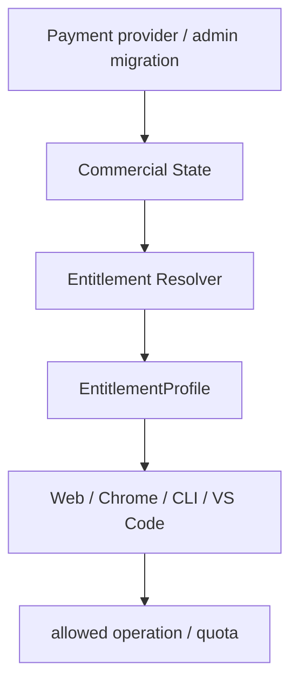

Encrypted Impact content remains outside this path.

### Explicit monetization invariants

- No paywall may make a user's existing vault unreadable.
- No plan may weaken encryption, recovery or export.
- Subscription expiry changes future entitlements, not ownership of existing data.
- Commercial metadata is kept logically separate from encrypted domain content.
- Plan identifiers and numeric limits are configuration/data, not constants embedded throughout clients.
- The pilot launches with unrestricted accounts, but through the same entitlement architecture that future
  Free/Pro accounts will use.

## 11.3 Regional data residency and shard migration

impact log is regional-ready from the pilot architecture even if the initial deployment uses only one
physical region. An account has a stable opaque Account ID and a mutable homeRegion. The Account ID must
not encode a region because users may later migrate their encrypted vault between regional data planes.

### Control Plane and Regional Data Planes

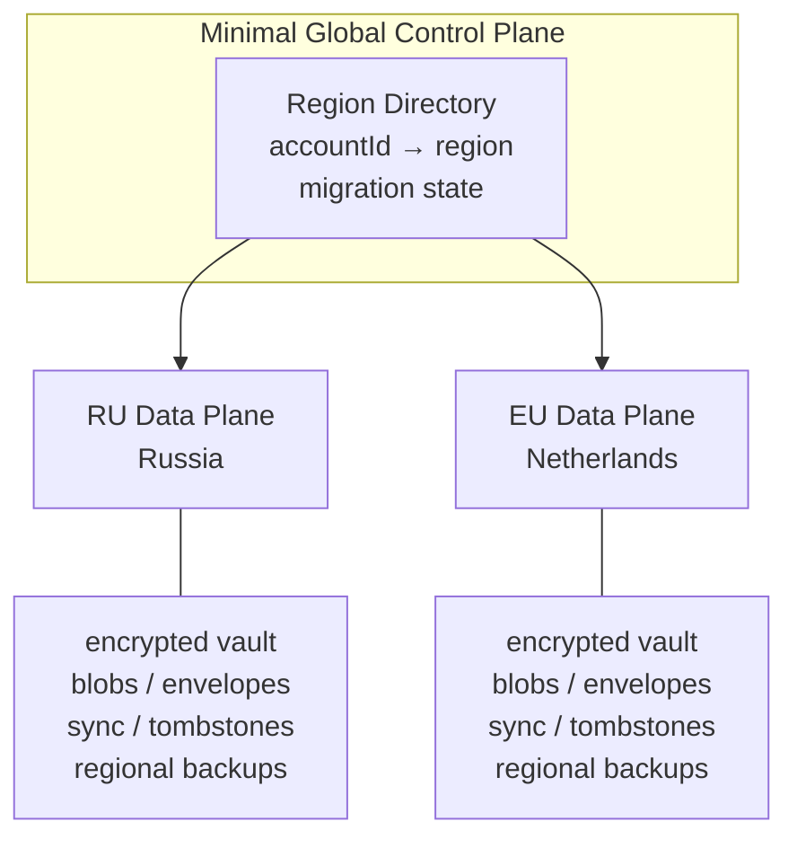

- The global/control-plane directory stores only the minimum routing state required to locate an
  account's home region.
- Sensitive vault state belongs to a regional data plane, not to the global directory.
- Regional backups, object storage and databases follow the same residency boundary as their primary
  regional data plane.
- RU and EU are initial conceptual region identifiers; concrete providers and locations are deployment
  configuration rather than domain constants.

### Stable account identity and routing

```text
Account ID: 7F82-KL92-PA71 (stable)

Region Directory:
7F82-KL92-PA71 → EU
```

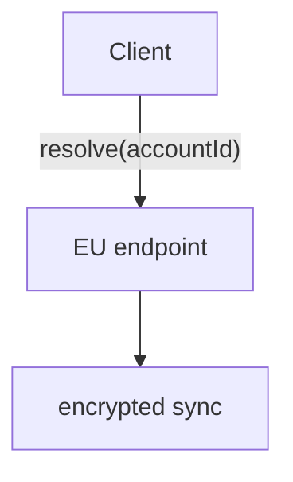

After a completed migration:

```text
7F82-KL92-PA71 → RU
```

The Account ID does not change.

Web/PWA, Chrome Extension, CLI and VS Code Extension resolve the regional endpoint rather than permanently
hard-coding a single data-plane API. Clients may cache the resolved endpoint for performance, but must be
able to invalidate/re-resolve it after migration or a regional-routing response.

### Home Region

- homeRegion is assigned at account creation according to the product's residency policy.
- homeRegion is not changed by travel, VPN usage or the current IP address.
- Changing homeRegion is not an ordinary account update; it is allowed only through the Region Migration
  protocol.
- The product may eventually expose a user-facing 'Move storage region' action, subject to availability
  and applicable legal/compliance policy.

### Region Migration state machine

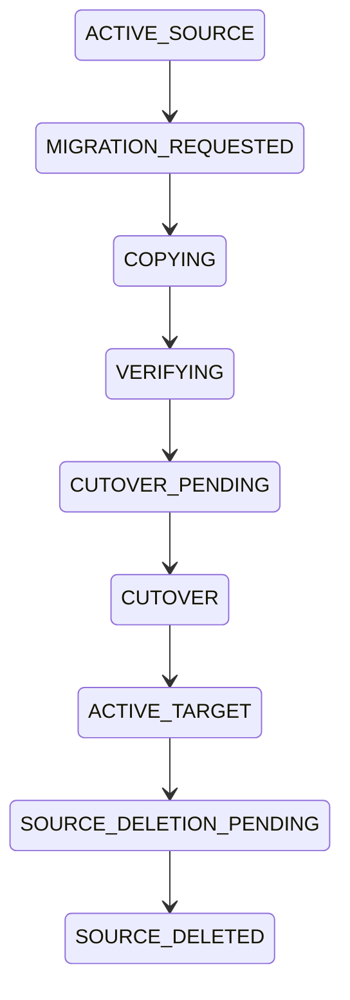

The migration is an account-level workflow with explicit state, idempotency and recovery semantics. A
simple `UPDATE homeRegion` is forbidden because routing must not switch before the destination contains a
verified complete vault.

### Migration data set

A migration must account for the complete regional account data set, including:

- Encrypted Impact objects and their versions.
- Encrypted attachment/blob objects and derived encrypted artifacts.
- Tombstones and deletion/compaction state.
- Device public keys and client/device key envelopes.
- Recovery envelope and its versioned KDF metadata.
- Sync cursors/state required for clients to continue safely.
- Regional quota/resource counters and other account state required by the data plane.
- Any regional metadata or indexes required to interpret opaque encrypted objects without plaintext
  access.

### Ciphertext transfer and integrity verification

Region migration does not require decryption. Existing ciphertext and wrapped key material can be copied
byte-for-byte between regional data planes. The Master Key and DEKs do not need to change merely because
storage location changes.

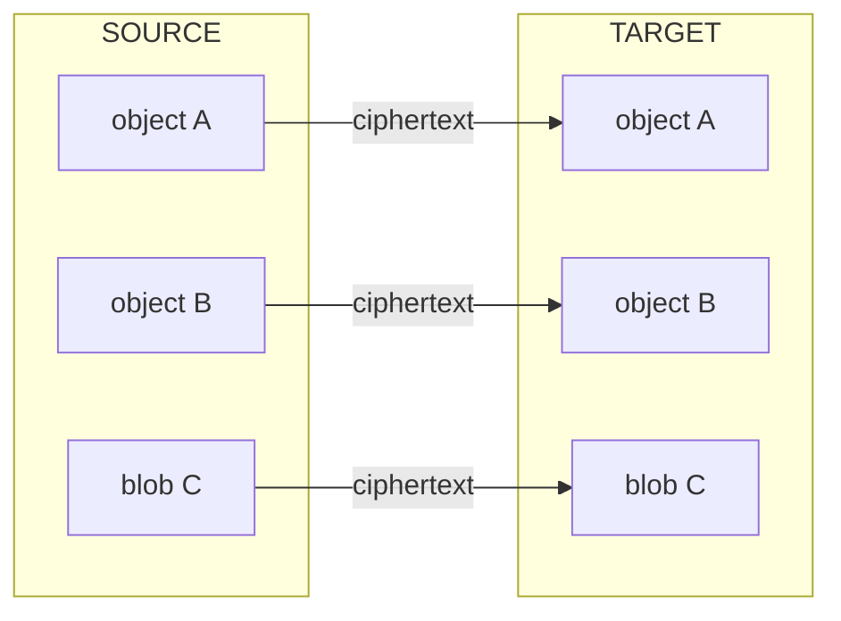

```text
manifest/hash verification:
  A: expected hash == target hash
  B: expected hash == target hash
  C: expected hash == target hash

Only after complete verification may CUTOVER occur.
```

### Writes during migration

The exact online-migration strategy is deferred to a dedicated ADR, but the protocol must define a
consistency boundary. Possible implementations include a short write freeze during final
synchronization/cutover, or a replicated change journal followed by a final barrier. The first
implementation should prefer correctness and simplicity over zero-downtime migration.

### Source deletion, backups and rollback

- Successful cutover and source deletion are separate states.
- The source region may be retained temporarily for rollback only if the declared residency/privacy policy
  permits it.
- Primary database deletion is insufficient: object storage, replicas, caches, snapshots and backups must
  have documented deletion/expiry semantics.
- The UI must not claim that data has fully left a region until the applicable source-retention policy has
  been satisfied.
- Migration audit metadata may be retained separately from vault content where required for operational
  integrity, but must be minimized.

### Optional key rotation

Storage migration alone does not require cryptographic key rotation. A future advanced operation may
combine region migration with MK rotation when the user wants to revoke trust in previously copied key
material. This is a separate security workflow: rotate MK and re-wrap DEKs rather than re-encrypting every
large attachment.

### Pilot behavior

The pilot may deploy only one physical region and expose no region selector or migration button.
Nevertheless, account identity, endpoint resolution, storage abstractions and sync contracts must not
assume that only one regional data plane can ever exist.

- Do not encode region in Account ID.
- Do not scatter a single hard-coded API/storage region through clients.
- Keep object/blob identifiers portable across regional data planes.
- Keep provider-specific storage identifiers behind regional storage adapters.
- Do not implement the migration engine until a second region is actually required.

## 12. Implementation order / dependency map

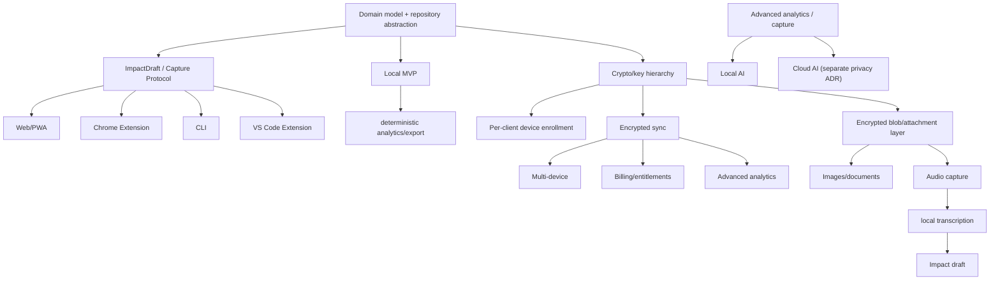

## 13. What must be correct from day one

- Stable object IDs and schema versioning.
- Domain/persistence separation.
- Repository abstraction and local-first write path.
- Analytics implemented independently from backend storage.
- No backend assumptions that require plaintext Impact fields.
- Export format that allows users to leave the product.
- AttachmentRef must be an allowed extension point in the Impact schema even if binary upload is not
  implemented in MVP.
- Recovery wire format and envelope versioning must be designed before any real encrypted user data is
  stored in production; changing recovery semantics later can strand existing vaults.
- Entitlement checks and quota contracts must have a single shared model from the pilot onward, even
  though the PILOT profile resolves all current limits to unrestricted.
- Account identity and client endpoint resolution must be region-agnostic from day one. Region migration
  itself may wait, but the pilot must not encode assumptions that make ciphertext/data-plane portability
  impossible.

## 14. What can deliberately wait

- A second physical region, user-facing region selector and Region Migration engine; only regional-ready
  contracts are required for the pilot.
- Accounts and cloud infrastructure.
- Multi-device pairing.
- Sophisticated conflict resolution / CRDT.
- Payments.
- Advanced dashboards.
- Local LLM.
- Cloud LLM.

## 15. Follow-up ADRs

> Номера ниже — из документа владельца. Соответствие нашим номерам — в таблице
> [«Соответствие follow-up ADR»](#соответствие-follow-up-adr) в начале файла.

- ADR-002 — Cryptographic primitives, key envelopes, password/recovery KDF parameters, Recovery Key
  binary/text format, checksum, test vectors, rotation and disaster-recovery protocol.
- ADR-003 — Offline sync protocol, conflict/tombstone/compaction semantics.
- ADR-004 — Authentication and device enrollment without mandatory email.
- ADR-005 — Commercial entitlements and billing: PILOT/FREE/PRO profiles, quota semantics, entitlement
  resolution, billing-provider mapping, subscription lifecycle and pilot migration policy.
- ADR-006 — Local AI runtime/model selection and browser capability policy.
- ADR-007 — Cloud AI data flow, provider boundary, retention and disclosure.
- ADR-008 — Encrypted attachment format, chunking, resumable transfer, derived artifacts and blob garbage
  collection.
- ADR-009 — Capture Protocol and client enrollment: ImpactDraft schema/versioning, Web/Chrome/CLI/VS Code
  runtime boundaries, secret storage and per-client authorization.
- ADR-010 — Regional data plane and migration protocol: region directory, residency boundaries, migration
  consistency barrier, integrity manifests, cutover/rollback, source deletion and backup expiry.

## 16. Decision summary

Start as a local application, not as a SaaS database with a UI. Preserve the invariant that the backend
never needs Impact plaintext. Treat Web/PWA as the canonical client and expose a versioned
ImpactDraft/Capture Protocol to Chrome Extension, CLI and VS Code Extension. Use entitlements from the
pilot onward while resolving PILOT accounts to unrestricted capabilities. Keep account identity
region-agnostic and separate a minimal routing/control plane from regional encrypted data planes so a vault
can later migrate between regions without decryption or Account ID changes. Add server capabilities only
when they provide user-visible value: encrypted sync, multi-device, regional residency and commercial
entitlements. Keep deterministic analytics local; add AI later as an optional presentation/synthesis
layer.
