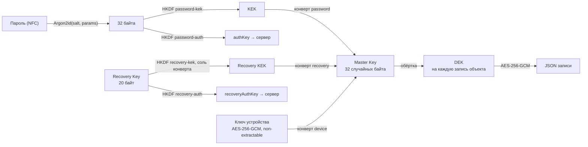

# ADR-0006: Криптография — иерархия ключей, конверты, Recovery Key

- Статус: принято
- Дата: 2026-09-28
- Основание: [ADR-0005](0005-local-first-e2ee-architecture.md), §7.2 и §9 (в документе владельца — «ADR-002»)
- Код: `packages/core/src/crypto/*` (`aead`, `kdf`, `password`, `envelope`, `recovery`, `object`, `vault`),
  тесты и тест-векторы — `packages/core/test/crypto.test.ts`; хранение ключей в браузере —
  `apps/web/src/vault/{vault,keyring,db}.ts`, флоу аккаунта — `apps/web/src/composables/useAccount.ts`,
  `apps/web/src/account/keys.ts`; серверная сторона — `apps/api/src/modules/auth/authKey.ts`,
  `apps/api/src/lib/crypto.ts`

## Контекст

ADR-0005 требует, чтобы сервер никогда не видел ни открытого содержимого записей, ни ключей, а ключ
данных не зависел от пароля. Этот ADR фиксирует примитивы, параметры, форматы (они «замораживаются»:
изменить их после появления реальных зашифрованных данных — значит бросить старые хранилища) и честную
модель угроз.

## Решение

### 1. Примитивы

Никакой самодельной криптографии: только WebCrypto (браузер и Node) и `hash-wasm` для Argon2id.

| Назначение | Примитив | Где |
| --- | --- | --- |
| Шифрование и обёртка ключей (AEAD) | AES-256-GCM, случайный nonce 96 бит, тег 128 бит | `crypto/aead.ts` (WebCrypto) |
| Ключ из пароля | Argon2id (RFC 9106), выход 32 байта | `crypto/kdf.ts` (`hash-wasm`) |
| Ключи из высокоэнтропийных секретов | HKDF-SHA256 (RFC 5869) | `crypto/kdf.ts` (WebCrypto) |
| Хеш | SHA-256 | `crypto/kdf.ts` |
| Случайность | `crypto.getRandomValues` / `crypto.randomUUID` | `crypto/encoding.ts`, `ids.ts` |
| Кодирование | base64url без паддинга; Recovery Key — Crockford Base32 | `crypto/encoding.ts`, `crypto/recovery.ts` |

Выход AEAD всегда `nonce (12 байт) ‖ ciphertext ‖ tag (16 байт)`. Ключи одноразовые или с малым числом
сообщений (DEK — одно сообщение), поэтому случайный 96-битный nonce безопасен.

### 2. Иерархия ключей



- **Master Key (MK)** — 32 случайных байта (`generateMasterKey`), создаётся на устройстве при первом
  запуске (`createVault`), ещё до аккаунта. При регистрации клиент генерирует **новый** MK аккаунта и
  переводит на него локальное хранилище — только после подтверждения кода 2FA (`adoptMasterKey`, §8).
  Из пароля MK не выводится никогда.
- **DEK** — 32 случайных байта; новый DEK генерируется при **каждом** шифровании объекта
  (`encryptObject`), то есть на каждую сохранённую версию записи. DEK обнуляется сразу после
  использования.
- **KEK** из пароля и **Recovery KEK** используются только для обёртки/развёртки MK.
- Пока вкладка открыта, MK живёт в памяти (`apps/web/src/vault/keyring.ts`): сырые байты — для создания
  новых конвертов, импортированный неэкспортируемый `CryptoKey` — для шифрования объектов. На диске MK
  есть только в конвертах.
- **Отпечаток MK** (`masterKeyId`): первые 16 байт `HMAC-SHA256(MK, "impact-log/v1/mk-id")`, base64url.
  Лежит в записи хранилища (`meta.vault.mkId`) и в памяти вкладки рядом с MK. Необратим и для расшифровки
  ничего не даёт; нужен, чтобы запись объектов могла проверить «хранилище всё ещё под моим MK» (§8).
  Хранилищам, созданным до его появления, отпечаток дописывает `loadVault`.

### 3. Параметры Argon2id

| Параметр | v1 по умолчанию (`PASSWORD_KDF_V1`, `DEFAULT_KDF_PARAMS`) | Минимум (`PASSWORD_KDF_MIN`) |
| --- | --- | --- |
| Память | 64 МиБ (`memoryKiB: 65536`) | 19 МиБ (`19456`) |
| Проходы | 3 | 2 |
| Параллелизм | 1 | 1 |
| Соль | 16 случайных байт | — |
| Выход | 32 байта | — |

- Пароль нормализуется в NFC перед хешированием. Длина пароля — 12–128 символов (`passwordSchema`).
  В web-клиенте Argon2id считается в Web Worker (`apps/web/src/account/kdf.worker.ts`), чтобы не замирал UI.
- Параметры и соль хранятся в двух местах: у пользователя на сервере (`users.kdf_params`, `users.kdf_salt`
  — клиент получает их через `prelogin`) и внутри password-конверта (привязаны AAD).
- Минимум защищает от «ослабленных» параметров, подсунутых сервером: и клиентская схема конверта, и
  `kdfParamsSchema` отвергают значения ниже 19 МиБ / 2 проходов.
- Верхние границы различаются: схема конверта в core допускает до 4 ГиБ / 64 проходов / параллелизм 16,
  `kdfParamsSchema` в shared (API) — до 1 ГиБ / 16 / 4. Действующее ограничение для аккаунта — shared.
- **Клиентский потолок** (`CLIENT_KDF_LIMITS`, `apps/web/src/account/keys.ts`): web-клиент не запускает
  Argon2id с параметрами выше 256 МиБ / 8 проходов / параллелизм 4 — ни из `prelogin`, ни из
  password-конверта (`KdfLimitError`, «вход остановлен»). Иначе сервер мог бы заставить вкладку выделить
  до 1 ГиБ (DoS вкладки/устройства).
- **TOFU параметров KDF.** После успешной регистрации, входа, смены пароля или восстановления клиент
  запоминает в записи хранилища `kdfPin = { login, kdf, salt }` (`meta.vault`). При следующем входе с
  тем же логином `prelogin` сверяется с ним (`compareKdfPin`): если `memoryKiB` или `iterations` стали
  меньше или сменилась соль, вывод ключей не начинается без явного подтверждения пользователя (диалог
  «Параметры защиты пароля изменились»; по умолчанию — отмена). Смена пароля и восстановление на этом
  устройстве обновляют `kdfPin` сами, поэтому предупреждение означает «параметры изменились не здесь»:
  это нормально после смены пароля на другом устройстве и подозрительно в остальных случаях.
  Ограничение: на устройстве без истории (первый вход) сверять не с чем.
- Усиление параметров: новые значения передаются при смене пароля или восстановлении (поле `kdf` в
  запросе); автоматического перехеширования при входе нет.

Сервер хранит не пароль и не KEK, а медленный хеш `authKey`: Argon2id `m=19456 KiB, t=2, p=1`
(`@node-rs/argon2`) от канонической base64url-формы 32 байт (`apps/api/src/modules/auth/authKey.ts`).
Основную цену перебора задаёт клиентский KDF; серверный хеш нужен, чтобы утечка БД не давала готовый ключ
входа.

### 4. Метки HKDF

| Метка (`info`) | Вход (IKM) | Соль | Выход | Код |
| --- | --- | --- | --- | --- |
| `impact-log/v1/password-kek` | выход Argon2id | пустая | 32 байта, KEK | `crypto/password.ts` |
| `impact-log/v1/password-auth` | выход Argon2id | пустая | 32 байта, `authKey` (base64url, 43 символа) | `crypto/password.ts` |
| `impact-log/v1/recovery-kek` | 20 байт Recovery Key | соль recovery-конверта (16 байт) | 32 байта, Recovery KEK | `crypto/recovery.ts` |
| `impact-log/v1/recovery-auth` | 20 байт Recovery Key | пустая | 32 байта, `recoveryAuthKey` | `crypto/recovery.ts` |
| `impact-log/prelogin-salt/v1` | `TOTP_ENCRYPTION_KEY` (сервер) | пустая | 32 байта, ключ HMAC «фальшивой» соли | `apps/api/src/app.ts` |
| `impact-log/v1/totp-secret` | `TOTP_ENCRYPTION_KEY` (сервер) | пустая | 32 байта, ключ AES-256-GCM для TOTP-секретов (формат `v2:`, AAD = `users.id`, тег 16 байт) | `apps/api/src/lib/crypto.ts` |

KEK и `authKey` получаются из одного выхода Argon2id с разными метками — из `authKey` нельзя получить KEK,
поэтому сервер, проверяя вход, не может расшифровать данные. Две последние метки — внутренние серверные
(один секрет из env — два независимых ключа), в клиентский протокол не входят. Отпечаток MK
(`impact-log/v1/mk-id`, §2) — не HKDF, а HMAC-SHA256 с этой строкой в качестве сообщения.

### 5. Форматы

#### Ключевой конверт v1 (`crypto/envelope.ts`)

```json
{
  "v": 1,
  "type": "password | recovery | device",
  "kdf": { "id": "argon2id", "memoryKiB": 65536, "iterations": 3, "parallelism": 1 },
  "salt": "<base64url, 16 байт; у device — пустая строка>",
  "wrapped": "<base64url(nonce ‖ AES-256-GCM(MK) ‖ tag)>"
}
```

- Варианты `kdf`: `{ "id": "argon2id", … }` — password; `{ "id": "hkdf-sha256" }` — recovery;
  `{ "id": "none" }` — device (ключ устройства — готовый `CryptoKey`).
- AAD: `impact-log/envelope/v1/<type>/<kdf>/<salt>`, где `<kdf>` — `argon2id:<memoryKiB>:<iterations>:<parallelism>`
  или просто идентификатор. Подмена типа, параметров или соли ломает расшифровку (тест «подмена параметров
  KDF в конверте ломает проверку»).
- После развёртки проверяется длина MK (32 байта).
- На сервере конверт — непрозрачная строка ≤ 4096 символов (`envelopeTextSchema`), по одному на тип:
  `key_envelopes (user_id, type)`, типы `password` и `recovery`. Device-конверт на сервер не уходит.

#### Зашифрованный объект v1 (`crypto/object.ts`)

```json
{
  "v": 1,
  "alg": "A256GCM",
  "k": "<base64url(nonce ‖ AES-GCM_MK(DEK) ‖ tag)>",
  "c": "<base64url(nonce ‖ AES-GCM_DEK(payload) ‖ tag)>"
}
```

- AAD для `k`: `impact-log/dek/v1/<kind>/<objectId>`; для `c`: `impact-log/object/v1/<kind>/<objectId>`.
  Шифротекст привязан к `objectId` и виду: сервер не может незаметно выдать один объект за другой.
- `payload` — UTF-8 JSON всего доменного объекта (для Impact — со `schemaVersion`, датами, метриками,
  evidence). Вне шифротекста остаются только поля синхронизации (ADR-0007).
- Один и тот же формат в IndexedDB и на сервере: синхронизация ничего не перешифровывает.
- Лимит — 256 КиБ шифротекста на объект (`MAX_OBJECT_CIPHERTEXT`).
- Этим же форматом шифруются названия устройств (`kind = 'device-label'`, `objectId = deviceId`,
  `apps/web/src/account/deviceLabel.ts`) и будут шифроваться метаданные вложений
  (`AttachmentRef.encryptedMetadata`).

### 6. Recovery Key, формат ILRK1

```text
ILRK1-XXXX-XXXX-XXXX-XXXX-XXXX-XXXX-XXXX-XXXX-CC
```

- **Энтропия:** 20 байт (160 бит) из CSPRNG — верхняя граница диапазона 128–160 бит из ADR-0005.
- **Кодирование:** Crockford Base32, алфавит `0123456789ABCDEFGHJKMNPQRSTVWXYZ` (без I, L, O, U), биты
  старшим вперёд; 160 бит = ровно 32 символа, без паддинга.
- **Контрольная сумма `CC`:** первые 10 бит `SHA-256("ILRK1" ‖ bytes)` → 2 символа Base32. Ловит опечатки
  до вывода ключа (случайная ошибка проходит с вероятностью 1/1024); секретной энтропии не добавляет.
- **Оформление:** префикс `ILRK1` — версия формата; тело из 34 символов разбито дефисами на группы по 4
  (последняя группа — 2 символа контрольной суммы).
- **Разбор** (`parseRecoveryKey`): регистр не важен; пробелы, `-`, `_`, `.` удаляются; после префикса
  `O→0`, `I→1`, `L→1`; длина тела должна быть 34. Ошибки: `RecoveryKeyError('format')` (префикс, длина,
  символ вне алфавита, в т.ч. `U`) и `RecoveryKeyError('checksum')`. Ключ с верной контрольной суммой, но
  чужой — `CryptoError` при развёртке конверта (GCM-тег).
- **Вывод ключей:** HKDF-SHA256 (§4). Memory-hard KDF не используется сознательно: 160 бит равномерной
  энтропии не перебираются, а Argon2id лишь замедлил бы законное восстановление. ADR-0005 допускает это
  («Argon2id where appropriate»); идентификатор `hkdf-sha256` записан в конверт, так что параметры можно
  сменить новой версией.
- **На сервере:** recovery-конверт и SHA-256 (hex) от `recoveryAuthKey` (`users.recovery_auth_hash`),
  сравнение за постоянное время. Сам ключ, Recovery KEK и MK сервер не получает.

Тест-векторы (`packages/core/test/crypto.test.ts`, «формат заморожен»):

| Байты (20) | Recovery Key | `recoveryAuthKey` |
| --- | --- | --- |
| `00 01 02 … 13` (0…19) | `ILRK1-000G-40R4-0M30-E209-185G-R38E-1W81-24GK-GJ` | `A-09C7UkaHAEOo4A56oNCG7ambCGqMwehFPzMwQglFk` |
| все `FF` | `ILRK1-ZZZZ-ZZZZ-ZZZZ-ZZZZ-ZZZZ-ZZZZ-ZZZZ-ZZZZ-HS` | — |
| все `00` | `ILRK1-0000-0000-0000-0000-0000-0000-0000-0000-NF` | — |

Там же проверяется: `' ilrk1 000g 4oR4 0m30-e2o9 185g r38e 1w8l 24gk gj '` разбирается в первый вектор;
`…-24GK-GK` и `…-24KG-GJ` дают ошибку контрольной суммы; `ILRK2-…` и короткий ключ — ошибку формата.

### 7. Ключ устройства

- `crypto.subtle.generateKey({ name: 'AES-GCM', length: 256 }, false, ['encrypt', 'decrypt'])` —
  **неэкспортируемый** `CryptoKey`; хранится в IndexedDB (`impact-log` → `meta.deviceKey`) как structured
  clone. Его байты не может прочитать даже JavaScript этой страницы — только использовать.
- Device-конверт (`type: device`, `kdf: none`, `salt: ""`) лежит рядом, в `meta.vault.deviceEnvelope`.
- При старте приложения `loadVault()` разворачивает MK автоматически: на известном устройстве пароль не
  спрашивается. Платформенной аутентификации (WebAuthn / биометрии) пока нет.
- При каждой пересборке конверта (`adoptMasterKey`) генерируется новый ключ устройства; ключ и конверт
  записываются одной транзакцией IndexedDB (не бывает конверта без ключа и наоборот).
- Отличие от ADR-0005 (Stage 4): не пара ключей, а симметричный ключ; публичного ключа и device-конверта
  на сервере нет. Следствие: подключить новое устройство «с доверенного» (QR) пока нельзя, только паролем
  (+ TOTP) или Recovery Key (ADR-0008).

### 8. Ротации

| Что | Как | Перешифровка данных |
| --- | --- | --- |
| Пароль | Новая соль (и, при желании, параметры) → новые KEK и `authKey` → новый password-конверт того же MK; `POST /api/account/password` | нет |
| Recovery Key | Новый ключ → новый recovery-конверт и `recoveryAuthKey`; старый перестаёт работать сразу; `POST /api/account/recovery-key` | нет |
| MK | `rewrapObject(oldMk, newMk, ref, text)` переоборачивает только `k`, поле `c` не меняется (тест) | нет, только DEK |
| Формат | Новая версия `v` конверта/объекта; старые читаются по своей версии | по мере перезаписи |

Ротация MK сейчас используется в одном месте — `adoptMasterKey` (`apps/web/src/vault/vault.ts`):
устройство с локальными записями регистрирует аккаунт или входит в существующий и переходит на его MK.
Полный флоу «сильного отзыва» (новый MK → переобёртка всех объектов → push → новые
password/recovery-конверты) **не реализован**: на сервере нет атомарной операции, которая заменила бы
конверты и все объекты разом. Следствие: смена пароля не отзывает доступ, который уже получен (MK тот же).

#### Смена MK хранилища (`adoptMasterKey`)

Смена MK переписывает всё хранилище, поэтому она атомарна и изолирована от других вкладок:

1. **Блокировка.** Вся операция — под Web Lock `impact-log:rekey` (без Web Locks — без ожидания); вторая
   вкладка ждёт. Синхронизация на время смены остановлена (`sync.stop()` рассылается и соседним вкладкам).
2. **Подготовка без записи.** Прочитать запись хранилища и все объекты; убедиться, что `meta.vault.mkId`
   совпадает с отпечатком MK этой вкладки (иначе ключ уже сменила другая вкладка — `VaultChangedError`).
   Для каждого объекта: расшифровать прежним MK и переобернуть DEK новым (`rewrapObject`, поле `c` не
   меняется); не открылся прежним, но открывается новым (пришёл из того же аккаунта) — перенести как есть;
   не открылся ни тем, ни другим — в **карантин** (store `quarantine`, IndexedDB v2: объект как есть,
   причина, отпечаток ключа, время). Один повреждённый объект больше не делает смену ключа невозможной.
   Tombstone'ы отбрасываются, все перенесённые объекты становятся новыми для сервера (`version: 0, dirty: 1`),
   конфликты прежнего аккаунта удаляются. Там же — новый ключ устройства, новый device-конверт, новая
   запись хранилища (новый `mkId`, привязка аккаунта, `kdfPin`) и начальное состояние синхронизации.
3. **Одна транзакция** на `objects`, `conflicts`, `meta`, `quarantine`: сначала сверка — объекты и
   конверт в базе те же, что при подготовке (иначе откат и повтор подготовки, до 3 раз), затем замена
   всего разом. Сбой или закрытие вкладки до `tx.done` оставляют хранилище под прежним MK целиком.
4. **Только после `tx.done`** MK в памяти вкладки меняется на новый (`setMasterKey`), соседние вкладки
   получают сигнал `vault-changed` и перезагружаются.

Изоляция записи: `save()`/`remove()` репозитория и применение решений синхронизации идут одной
транзакцией с чтением `meta.vault` и сверяют `mkId` с отпечатком ключа, которым зашифрованы данные
(ключ и отпечаток берутся одним снимком до шифрования). Если другая вкладка успела сменить MK, запись
отклоняется целиком (`VaultChangedError`), вкладка перезагружается — старым MK в новое хранилище ничего
не попадает.

Порядок во флоу аккаунта (`apps/web/src/composables/useAccount.ts`):

- **Регистрация:** новый MK аккаунта держится только в памяти (`PreparedRegistration`) до успешного
  `register/confirm` (код 2FA); только после него — `adoptMasterKey` с привязкой аккаунта в той же
  транзакции. Закрыли вкладку раньше — локальные записи целы под прежним MK, аккаунт можно подключить
  позже входом.
- **Вход и восстановление:** если на устройстве есть записи, а MK хранилища не совпадает с MK аккаунта,
  ничего не сливается молча — пользователь выбирает: «Добавить N записей в аккаунт» (смена MK),
  «Стереть записи с устройства и войти» (та же транзакция без переноса объектов) или «Отмена» (при входе
  только что открытая сессия закрывается; при восстановлении вопрос задаётся до `recovery/complete`, и
  сервер не меняется).
- Перед запросом, который меняет cookie сессии (`login`, `recovery/complete`), синхронизация
  останавливается; все запросы `/api/sync/*` несут `X-Impact-Account` — публичный Account ID хранилища,
  и сервер отвечает 409 `ACCOUNT_MISMATCH`, если сессия принадлежит другому аккаунту. Клиент в этом
  случае останавливает синхронизацию и данные не трогает.

Карантин только локальный: в синхронизацию и экспорт не попадает, стирается вместе с хранилищем
(и при «Стереть записи с устройства и войти»). Если карантин не пуст, «Настройки → Данные» показывают число
объектов и дают скачать их как есть (шифротекст в JSON) или удалить (`listQuarantine` / `clearQuarantine`
в `src/vault`).

### 9. Модель угроз: что защищено и что нет

| Сценарий | Защищено | Не защищено / оговорки |
| --- | --- | --- |
| Утечка БД или бэкапа | Содержимое записей (AES-256-GCM), MK, пароль. Перебор пароля по password-конверту стоит Argon2id 64 МиБ на попытку; `authKey` — под Argon2id; TOTP-секреты зашифрованы ключом, выведенным из секрета в env (формат v2, AAD = id пользователя — шифротекст нельзя переставить другому) | Метаданные: логин, `accountId`, тариф, число и размеры объектов, время изменений, число устройств и `last_seen_at`. Слабый пароль перебирается офлайн |
| Любопытный сервер (honest-but-curious) | Содержимое: у сервера нет ключей | Те же метаданные плюс время и объём синхронизации, IP (в логах — усечённые) |
| Скомпрометированный сервер, API-уровень | Подмена объекта другим объектом (AAD c `objectId`), подмена параметров конверта (AAD), параметры KDF ниже минимума или выше клиентского потолка; на устройстве, где уже входили, — ослабление параметров KDF или смена соли без подтверждения пользователя (TOFU, §3) | **Откат** объекта к его старому шифротексту (версия не входит в AAD), сокрытие или удаление объектов, «заморозка» состояния — целостность множества объектов и свежесть не защищены. На новом устройстве (без `kdfPin`) через `prelogin` сервер может отдать соль по своему выбору и параметры на минимуме (19 МиБ, t=2) и получить `authKey` для офлайн-перебора пароля по этой цене |
| Сервер отдаёт вредоносный JS (web-клиент грузится с того же домена) | — | **Полная компрометация**: код в origin читает MK из памяти и открытый текст. Это фундаментальный предел E2EE в вебе. Есть: строгая CSP (`script-src 'self' 'wasm-unsafe-eval'` — только компиляция WebAssembly для Argon2id, без `eval`), никаких сторонних скриптов и CDN. Нет: подписи/SRI бандла, воспроизводимой сборки, внешней проверки версии |
| XSS в web-клиенте | То же, что выше: неэкспортируемость ключа устройства мешает скопировать ключ, но не мешает им пользоваться | Защита — только недопущение XSS: CSP, экранирование Vue, Markdown через `marked` + DOMPurify (сырой HTML записи показывается текстом, `class` — только у разметки рендерера, без `style`/`id`), черновики из `#draft=` проходят zod-схему и показываются в форме. Сырые байты MK лежат в памяти вкладки |
| Украденное разблокированное устройство / копия профиля браузера | Отзыв устройства на сервере прекращает его синхронизацию (ADR-0008) | Хранилище открывается без пароля; `non-extractable` защищает от JS, а не от доступа к профилю на диске. Уже скопированные данные и MK не стереть (ADR-0005 это признаёт); ротации MK нет, поэтому смена пароля не отзывает уже полученный доступ |
| Кража Recovery Kit | Вход по киту — только со вторым фактором: код 2FA (новый пароль) или пароль (новая 2FA). Без него — отложенное восстановление: 48 ч, всё это время вошедшие устройства видят предупреждение и могут отменить (ADR-0008 §7) | Recovery Key — ключ **расшифровки**: кит + шифротекст (утечка БД/бэкапа) = открытые данные без всяких задержек. Если 48 ч никто не откроет приложение на вошедшем устройстве, предупреждение не увидят (почты нет). После созревания задержки — новый пароль и перевыпуск 2FA без текущего кода. Кит — главный ключ, хранить офлайн |
| Потеря всех устройств, пароля и Recovery Key | — | Данные невосстановимы. «Админского» ключа нет и не будет |
| Сетевой атакующий | TLS (HSTS) + E2EE поверх | — |
| Перебор пароля онлайн, перечисление аккаунтов | Лимиты частоты по IP (IPv6 — по /64) и по паре «логин + IP»; обязательная TOTP с блокировкой перебора на пользователя (10 неудач → 15 мин, удвоение до 24 ч, ADR-0008 §5); фальшивая соль в `prelogin`, одинаковые ошибки и «холостая» проверка Argon2id | Блокировка TOTP даёт рычаг помешать входу владельца тому, кто уже знает пароль (до 24 ч); выход — пароль + Recovery Key вместо кода (ADR-0008 §7) |
| Клиенты захвата (Chrome, CLI, VS Code) | Не держат ключей и не ходят в API — их компрометация не раскрывает хранилище | Могут подсунуть черновик; запись появляется только после подтверждения в web-клиенте (ADR-0010) |

## Последствия

- (+) Сервер — непрозрачное хранилище: ни пароля, ни MK, ни содержимого. Смена пароля и Recovery Key —
  без перешифровки данных; ротация MK — только переобёртка DEK.
- (+) Форматы версионированы (`v`, `ILRK1`, `kdf.id`), Recovery Key заморожен тест-векторами.
- (−) Защита web-клиента от злонамеренного оператора ограничена: кто отдаёт JS, тот видит данные.
- (−) Откат отдельных объектов сервером не обнаруживается. Кандидат на v2 формата объекта — версия/счётчик
  в AAD или подписанный манифест.
- (−) На известном устройстве хранилище не заперто: безопасность данных на устройстве = безопасность
  профиля браузера.
- (+) Смена MK хранилища атомарна (одна транзакция IndexedDB) и изолирована от соседних вкладок
  (Web Lock + отпечаток MK при каждой записи); нерасшифровываемые объекты уходят в карантин, а не
  блокируют переход.
- (−) Карантин только на устройстве: восстановить объекты из него приложение не умеет — их можно лишь скачать
  как есть или удалить («Настройки → Данные»).
- (−) TOFU параметров KDF защищает только устройства, где уже входили; первый вход доверяет `prelogin`.

## Альтернативы

- **Ключ данных из пароля** — отвергнуто ADR-0005: смена пароля означала бы перешифровку всего.
- **Argon2id и для Recovery Key** — не нужно при 160 битах энтропии, только замедляет восстановление.
- **BIP-39-слова вместо Base32** — длиннее для 160 бит, зависит от словаря и языка; Base32 с контрольной
  суммой проще продиктовать и проверить.
- **Пара ключей на устройство (ECDH/RSA-OAEP) и device-конверты на сервере** — нужна для QR-сопряжения и
  входа без пароля с доверенного устройства; отложено до реализации этих сценариев.
- **libsodium (XChaCha20-Poly1305)** — лишняя WASM-зависимость; AES-256-GCM есть в WebCrypto везде.
