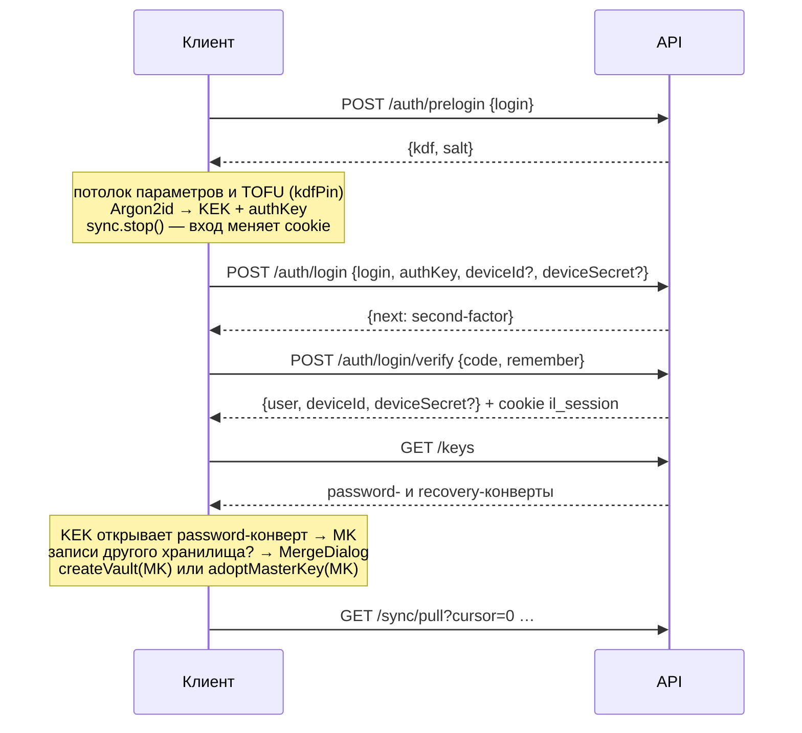

# ADR-0008: Аутентификация, восстановление и устройства в модели E2EE

- Статус: принято
- Дата: 2026-09-28; дополнено 2026-09-29 — восстановление: Recovery Key + второй фактор, без второго фактора —
  только с задержкой 48 ч (решение владельца, §8); ротация Master Key — [ADR-0012](0012-key-rotation.md)
  (§4, §8–10)
- Основание: [ADR-0005](0005-local-first-e2ee-architecture.md), Stage 3–4 и §7.2 (в документе владельца — «ADR-004»)
- Заменяет части: [ADR-0001](0001-auth-model.md) — пароль на сервере → `authKey`; резервные коды →
  Recovery Key (подробно — раздел «Что меняется в ADR-0001»)
- Код: `packages/shared/src/schemas/{auth,account}.ts`; `apps/api/src/modules/{auth,account,devices,keys}/*`
  (блокировка перебора TOTP — `modules/auth/totpGuard.ts`, отложенное восстановление —
  `modules/auth/delayedRecovery.ts`), `apps/api/src/plugins/{session,csrf}.ts`,
  `apps/api/src/lib/{rateLimit,crypto,logging}.ts`, `apps/api/src/utils/ip.ts`; клиентская криптография —
  `packages/core/src/crypto/{password,recovery,vault}.ts`; флоу web-клиента — `apps/web/src/composables/useAccount.ts`,
  `apps/web/src/account/*`, диалоги `apps/web/src/components/{MergeDialog,KdfChangeDialog}`
- Справочник API: [docs/api.md](../api.md)

## Контекст

ADR-0001 строил вход на пароле, который приходил на сервер, и на резервных кодах 2FA. В модели E2EE
(ADR-0005, ADR-0006) пароль ещё и открывает Master Key, поэтому серверу его видеть нельзя, а восстановление
доступа без ключа к данным бессмысленно: сервер не может «сбросить» то, чего не знает. При этом остаются
требования ADR-0001: без почты и телефона, обязательная TOTP, минимум персональных данных.

## Решение

### 1. Идентификаторы

| Идентификатор | Формат | Для чего |
| --- | --- | --- |
| Логин | 3–32 символа `[a-z0-9_-]`, приводится к нижнему регистру (`loginSchema`) | вход, восстановление, резолвинг региона; остаётся из ADR-0001 |
| `accountId` | 12 символов Crockford Base32 из 60 случайных бит, показывается группами `7F82-KL92-PA71` | непрозрачный публичный ID аккаунта; регион не кодирует (ADR-0011) |
| `users.id` | UUID | внутренний ключ БД, наружу — только в `user.id` |
| `deviceId` | UUID | экземпляр клиента (ADR-0005: «per-client device identity») |

Почта и телефон не нужны и не собираются.

### 2. Prelogin и фальшивая соль

`POST /api/auth/prelogin { login } → { kdf, salt }` — параметры Argon2id и соль пароля, чтобы клиент мог
вывести ключи (ADR-0006). Для несуществующего или незавершённого логина сервер отдаёт **детерминированную
фальшивую соль**: первые 16 байт `HMAC-SHA256(k, "prelogin:" + login)`, где `k` выведен HKDF из
`TOTP_ENCRYPTION_KEY` с меткой `impact-log/prelogin-salt/v1`, и `kdf = DEFAULT_KDF_PARAMS`. Повторный
запрос даёт тот же ответ, по форме он неотличим от настоящего — prelogin не раскрывает существование
аккаунта.

Оговорка: пока у всех аккаунтов параметры по умолчанию. Если появятся аккаунты с усиленными параметрами,
они будут отличимы от фальшивого ответа — при смене `DEFAULT_KDF_PARAMS` фальшивые ответы должны идти
следом.

Web-клиент не доверяет ответу prelogin вслепую (подробно — ADR-0006 §3):

- **клиентский потолок** — параметры выше 256 МиБ / 8 проходов / параллелизм 4 не запускаются
  (`CLIENT_KDF_LIMITS`, вход останавливается), чтобы сервер не мог заставить вкладку выделить до 1 ГиБ;
- **TOFU** — устройство запоминает `{ login, kdf, salt }` последнего успешного входа, регистрации, смены
  пароля или восстановления (`kdfPin` в записи хранилища). Если при следующем входе с тем же логином
  параметры стали слабее или сменилась соль, ключи не выводятся без явного согласия в диалоге
  `KdfChangeDialog` (по умолчанию — отмена). На устройстве без истории сверять не с чем.

### 3. authKey вместо пароля

Клиент: `Argon2id(пароль, salt, kdf)` → HKDF → **KEK** (остаётся на клиенте, открывает password-конверт) и
**authKey** (32 байта, base64url) — он и уходит на сервер вместо пароля. Сервер хранит `Argon2id(authKey)`
(`m=19456 KiB, t=2, p=1`) и никогда не видит пароль. Из `authKey` нельзя получить KEK.

Вход: `POST /api/auth/login { login, authKey, deviceId?, deviceSecret? }` (про устройство — §9).
Неизвестный логин и неверный `authKey` неразличимы: `401 INVALID_CREDENTIALS`, для неизвестного логина —
проверка Argon2id «вхолостую» (равное время).

### 4. Что хранит сервер

| Данные | Как хранится |
| --- | --- |
| `authKey` | Argon2id, PHC-строка (`users.auth_key_hash`) |
| Параметры KDF и соль пароля | как есть (`users.kdf_params`, `users.kdf_salt`) — отдаются через prelogin |
| Конверты MK `password` и `recovery` | непрозрачные строки ≤ 4096 символов (`key_envelopes`), отдаются `GET /api/keys` только полной сессии |
| `recoveryAuthKey` | SHA-256 hex (`users.recovery_auth_hash`), сравнение за постоянное время |
| TOTP-секрет (и новый на время перевыпуска) | формат v2: `v2:` + base64url(iv).(тег 16 байт).(шифротекст), AES-256-GCM ключом `HKDF(TOTP_ENCRYPTION_KEY, 'impact-log/v1/totp-secret')`, AAD = `users.id` — шифротекст нельзя переставить в строку другого пользователя (`totp_secret`, `totp_pending_secret`); `totp_last_step` — защита от повтора |
| Счётчик неудачных кодов | `users.totp_failed_count`, `users.totp_locked_until` (§5) |
| Отложенное восстановление | `users.recovery_started_at`, `users.recovery_available_at` (§8, путь C) |
| Эпоха Master Key и идущая ротация | `users.key_epoch`; `key_rotations` (конверты нового MK, SHA-256 нового `recoveryAuthKey`, устройство-инициатор) и черновик `rotation_objects` до commit (ADR-0012) |
| Сессии | SHA-256 токена (`sessions.id`), вид, срок, попытки, устройство, флаг `via_recovery`, стадия восстановления (`recovery_stage`), новый TOTP-секрет сброса 2FA (`totp_pending_secret`, зашифрован как `users.totp_secret`) |
| Устройства | зашифрованное название, SHA-256 секрета устройства (`secret_hash`), SHA-256 trust-токена и срок, `created_at`, `last_seen_at`, `revoked_at` |
| Тариф | `users.plan` (ADR-0009) |

### 5. TOTP сохраняется

Как в ADR-0001: RFC 6238, SHA-1, 6 цифр, шаг 30 с, допуск ±1 шаг, повтор кода отклоняется
(`totp_last_step`, условное обновление — два параллельных запроса с одним кодом не пройдут оба). TOTP
обязательна: аккаунт остаётся `pending`, пока первый код не подтверждён. Не больше 5 неверных кодов на
сессию, дальше `SESSION_EXPIRED`.

**Блокировка перебора — на пользователя** (`apps/api/src/modules/auth/totpGuard.ts`): каждый `/login`
даёт новую second-factor-сессию, а IP можно менять, поэтому одного лимита на сессию мало. Каждая проверка
кода по действующему секрету (register/confirm, login/verify, recovery/verify, account/totp/start и /confirm,
account/delete) ещё до проверки атомарно увеличивает `users.totp_failed_count`. После 10 неудач подряд — `totp_locked_until = now + 15 мин`;
каждая следующая неудача без успеха между ними — снова блокировка, вдвое длиннее (30 мин, 1 ч, … не больше
24 ч). Во время блокировки код не проверяется вовсе — `429 RATE_LIMITED`. Верный код, завершение
восстановления (`recovery/complete`) и сброс 2FA по паролю и Recovery Key (`login/totp-reset`) обнуляют счётчик
и снимают блокировку. Цена: тот, кто знает пароль, может заблокировать вход по коду (и путь A восстановления);
выход для владельца — путь B (§8): пароль + Recovery Key, сброс 2FA блокировку не проверяет.

Перевыпуск 2FA: `POST /api/account/totp/start { currentAuthKey, code }` — нужен и пароль (`authKey`), и
**текущий код** (новый секрет ждёт подтверждения, старый работает) → `POST /api/account/totp/confirm { code }`
по новому секрету (остальные сессии завершаются). Без текущего кода перевыпуск возможен только в сессии,
созданной отложенным восстановлением (§8, путь C; `sessions.via_recovery`): телефона нет, а второй фактор
заменила выдержанная задержка с предупреждением на устройствах. После подтверждения флаг снимается — без кода
перевыпуск возможен один раз. Потерянный телефон при известном пароле — путь B (§8), без полной сессии.

### 6. Регистрация = подключение синхронизации к локальному хранилищу

Локальное хранилище уже есть на устройстве (onboarding без регистрации, ADR-0005 Stage 1). Регистрация
(`apps/web/src/composables/useAccount.ts`, криптография — `apps/web/src/account/keys.ts`):

1. Клиент генерирует **новый MK аккаунта** (у нового аккаунта всегда свой MK, даже если хранилище раньше
   было привязано к другому), соль, выводит KEK и `authKey` (`DEFAULT_KDF_PARAMS`; Argon2id считается в
   Web Worker, `account/kdf.worker.ts`), делает password-конверт, Recovery Key, recovery-конверт и
   `recoveryAuthKey` (`createRecoveryEnvelope`).
2. Клиент показывает Recovery Kit (§8); пользователь подтверждает, что сохранил ключ.
3. `POST /api/auth/register { login, authKey, kdf, salt, passwordEnvelope, recoveryEnvelope, recoveryAuthKey }`
   → `{ otpauthUri, secret }` и enrollment-сессия (30 мин). Логин занят — `409 LOGIN_TAKEN`;
   регистрация закрыта — `403 REGISTRATION_CLOSED`. Клиент показывает QR для приложения-аутентификатора.
4. `POST /api/auth/register/confirm { code, remember }` → аккаунт активен, создано первое устройство,
   полная сессия; ответ `{ user, deviceId, deviceSecret }`. **Только теперь** локальное хранилище переходит
   на новый MK (`adoptMasterKey`: DEK локальных записей переоборачиваются, записи станут новыми для сервера)
   и привязывается к аккаунту `{ userId, accountId, login, deviceId, deviceSecret }` вместе с `kdfPin`.
   Клиент шифрует MK название устройства (по умолчанию — из user-agent) и запускает синхронизацию (ADR-0007).

Брошенная незавершённая регистрация освобождает логин, если она старше 30 минут **или** у неё не осталось
живой enrollment-сессии (например, сессия сгорела после 5 неверных кодов); такие строки удаляет уборка через
час.

### 7. Вход на новом устройстве

С доверенного устройства (§9) `login` сразу отвечает `{ next: 'done', user, deviceId }` — без кода.
Если телефона с 2FA нет, на шаге кода вместо него предъявляется Recovery Key (§8, путь B).

Перед входом web-клиент останавливает синхронизацию (`sync.stop()`): вход меняет cookie сессии, и цикл
прежней сессии не должен продолжиться под новой (от этого же защищает заголовок `X-Impact-Account`,
ADR-0007 §3). Если на устройстве есть записи другого хранилища (под другим MK), до смены ключа
пользователь выбирает в диалоге `MergeDialog`: добавить их в аккаунт (по умолчанию — ничего не теряется),
стереть с устройства или отменить вход (тогда только что открытая сессия закрывается). Добавленные записи
переоборачиваются под MK аккаунта и уходят на сервер как новые (ADR-0007 §7).

### 8. Recovery Key и восстановление доступа

Один аварийный ключ вместо резервных кодов: Recovery Key (`ILRK1-…`, ADR-0006) открывает recovery-конверт MK.
Резервные коды 2FA из ADR-0001 удалены вместе с таблицей `recovery_codes`.

**Решение владельца (2026-09-29): Recovery Key + ещё один фактор; без второго фактора — только с задержкой
48 часов.** Сам по себе ключ больше не заменяет ни пароль, ни 2FA: украденный кит без второго фактора даёт доступ
лишь после задержки, которую видят все вошедшие устройства и которую владелец может отменить.

| Путь | Ситуация | Что предъявляет пользователь | Итог |
| --- | --- | --- | --- |
| A | забыт пароль | Recovery Key + код 2FA | новый пароль; 2FA прежняя |
| B | потерян телефон | пароль + Recovery Key вместо кода | новая 2FA; пароль прежний |
| C | потеряно всё | только Recovery Key, через `RECOVERY_DELAY_HOURS` = 48 ч | новый пароль, затем новая 2FA без кода |

Константы — `packages/shared/src/schemas/auth.ts` (`RECOVERY_DELAY_HOURS`, `RECOVERY_READY_TTL_DAYS`); серверная
часть — `apps/api/src/modules/auth/{auth.service,delayedRecovery}.ts`.

**Общее начало путей A и C.**

1. Пользователь вводит логин и Recovery Key. Клиент проверяет формат и контрольную сумму локально и выводит
   `recoveryAuthKey`.
2. `POST /api/auth/recovery/begin { login, recoveryAuthKey }` → recovery-сессия (15 мин, стадия
   `sessions.recovery_stage = key`) и `{ delayed: { status: none | pending | ready, availableAt? } }` — состояние
   отложенного восстановления. **Конверт здесь не выдаётся.** Неверный логин и неверный ключ неразличимы
   (одинаковый запрос, хеш, сравнение с «пустышкой»), ответ `401 INVALID_CREDENTIALS`. Лимит — 5 за 15 минут с IP;
   по логину лимита нет: 256-битный ключ не подобрать, а глобальный счётчик позволил бы запереть владельца.

**A. Recovery Key + код 2FA** (стадия `key` → `unlocked-totp`).

3. `POST /api/auth/recovery/verify { code }` → `{ recoveryEnvelope }`. Код проверяется как при входе: блокировка
   перебора на пользователя (§5), защита от повтора (`totp_last_step`), не больше 5 неверных кодов на сессию.
4. Клиент выводит Recovery KEK с солью конверта и разворачивает MK (ключ на сервер не уходит); пользователь
   задаёт новый пароль, клиент делает новый password-конверт **того же** MK.
5. `POST /api/auth/recovery/complete { authKey, kdf, salt, passwordEnvelope, deviceId?, deviceSecret? }` →
   обновлены `authKey`, KDF и конверт; **все** сессии пользователя удалены, доверие снято со всех устройств,
   блокировка перебора TOTP и отложенное восстановление сняты; выдана обычная (не 30-дневная) полная сессия
   **без** `via_recovery` — телефон у пользователя есть. До verify/resume — `403 FORBIDDEN`; recovery-сессия
   одноразовая (удаляется в той же транзакции).
6. Дальше — как вход на новом устройстве: выбор в `MergeDialog`, если на устройстве чужие записи, pull и
   расшифровка.

**B. Пароль + Recovery Key вместо кода** — шаг второго фактора обычного входа (§7).

1. `POST /api/auth/login` → `{ next: 'second-factor' }` (пароль проверен).
2. `POST /api/auth/login/recovery-key { recoveryAuthKey }` → `{ otpauthUri, secret }`: новый TOTP-секрет
   (зашифрован так же, как `users.totp_secret`, хранится в самой сессии — `sessions.totp_pending_secret`), сессия
   становится `totp-reset` (5 мин, попытки с нуля). Неверный ключ — `401 INVALID_CREDENTIALS` и попытка сессии,
   как неверный код (5-я — `SESSION_EXPIRED`). Старая 2FA работает, пока новая не подтверждена; перевыпуск 2FA
   из полной сессии (`users.totp_pending_secret`) не затрагивается.
3. `POST /api/auth/login/totp-reset { code, remember }` → полная сессия (`sessionResponseSchema`): секрет заменён,
   `totp_last_step` — шаг этого кода, блокировка перебора снята, **все остальные** сессии удалены, доверие снято
   со всех устройств (`remember` — доверие этому, как при обычном входе), отложенное восстановление снято.
   Пароль и данные не меняются; сессия не `via_recovery`. `totp-reset`-сессия одноразовая.

Блокировку перебора TOTP (§5) `login/totp-reset` **не проверяет и не увеличивает**. Блокировка защищает
действующий секрет от того, кто знает пароль; здесь же код — от секрета, который сессия только что выдала сама
после пароля и Recovery Key, подбирать нечего. Если бы блокировка действовала, чужой перебор старой 2FA (для него
хватает пароля) не давал бы владельцу её сбросить — а путь B и есть выход из такой блокировки. Перебор ограничен
попытками сессии (5) и лимитом по IP (15 за 5 мин); каждая новая `totp-reset`-сессия стоит пароля и Recovery Key.
Успешный сброс обнуляет счётчик: старый секрет, который перебирали, больше не действует.

**C. Только Recovery Key — с задержкой** (стадия `key` → `unlocked-delayed`).

3. `POST /api/auth/recovery/delay` → `{ availableAt }`: `users.recovery_started_at = now`,
   `users.recovery_available_at = now + 48 ч`. Идемпотентно: если отсчёт идёт (или созрел и не истёк) — прежний
   срок; повторный запуск его не сдвигает.
4. Всё это время `GET /api/auth/me` на каждом вошедшем устройстве отдаёт `recoveryPending: { availableAt }` —
   клиент показывает предупреждение. Владелец отменяет: `POST /api/account/recovery/cancel` (полная сессия, без
   тела и без повторного подтверждения — действие только защитное) — поля обнуляются, все recovery- и
   totp-reset-сессии пользователя удаляются.
5. Через 48 ч — снова `begin` (`delayed.status = ready`) и `POST /api/auth/recovery/resume` → `{ recoveryEnvelope }`.
   Рано — `403 RECOVERY_NOT_READY` с `details.availableAt`; не начато, отменено или истекло — тот же код без
   `details`. Созревшее восстановление доступно `RECOVERY_READY_TTL_DAYS` = 7 дней, потом считается несостоявшимся
   (`begin` → `none`, уборка раз в час обнуляет поля) — начинать заново.
6. `recovery/complete` — как в пути A, но новая сессия помечена `via_recovery`: в ней можно один раз перевыпустить
   2FA без текущего кода (§5) — телефона нет.

Отложенное восстановление **снимается**: отменой, завершением пути A или C, сбросом 2FA (путь B), сменой пароля,
перевыпуском Recovery Key, commit'ом ротации MK (ADR-0012) — владелец явно в строю; отмена, смена пароля,
перевыпуск ключа и ротация удаляют и незавершённые recovery-/totp-reset-сессии, так что уже полученная стадия
`unlocked-*` тоже пропадает, — и удалением аккаунта. Обычный вход и перевыпуск 2FA его **не** снимают: войти может и тот, у кого украли пароль вместе с китом,
а предупреждение должно оставаться на виду.

Стадии recovery-сессии: `verify`, `delay` и `resume` принимаются в любой стадии (успешный `verify` →
`unlocked-totp`; `resume` не понижает `unlocked-totp`), `complete` — только из `unlocked-*`. Переход стадии и
выдача конверта — в одной транзакции с проверкой, что сессия ещё жива: отмена или перевыпуск ключа, пришедшие
раньше, конверт уже не отдадут. Время задержки — часы приложения (как сроки сессий).

Перевыпуск Recovery Key (`POST /api/account/recovery-key`) удаляет все незавершённые recovery- и
totp-reset-сессии: восстановление или сброс 2FA, начатые старым ключом, завершить уже нельзя.

После восстановления стоит (UI должен предложить): отозвать потерянные устройства, перевыпустить TOTP после
пути C, перевыпустить Recovery Key, если он мог быть скомпрометирован, — а если ключ или устройство могли попасть
в чужие руки, сделать ротацию MK (ADR-0012): она выдаёт и новый Recovery Key. Автоматически Recovery Key не
меняется и продолжает работать.

Recovery Kit (текстовый файл, `apps/web/src/account/recoveryKitFile.ts`) содержит **логин** (он нужен
для восстановления), дату создания, Recovery Key (префикс `ILRK1` — версия формата) и инструкции с
предупреждением, что владелец кита получает доступ к хранилищу. Account ID в кит не попадает: при
регистрации он ещё неизвестен клиенту (сервер выдаёт его только в ответе `register/confirm`), а для
восстановления не нужен. Перед отправкой регистрации пользователь подтверждает, что сохранил ключ (ввод
последних символов). Кит — чувствительное действие UI: не логировать, не отдавать в аналитику и отчёты об
ошибках.

Сценарии из ADR-0005 §7.2:

| Ситуация | Что делать |
| --- | --- |
| Забыт пароль, есть Recovery Key и телефон | Путь A — новый password-конверт, данные не перешифровываются |
| Потерян телефон с TOTP, пароль помнит | Путь B — Recovery Key вместо кода при входе, новая 2FA; пароль прежний |
| Забыт пароль и потерян телефон (или все устройства), есть Recovery Key | Путь C — через 48 ч; затем перевыпуск 2FA без кода (`via_recovery`) и отзыв старых устройств |
| Потерян Recovery Key, есть вход | `POST /api/account/recovery-key { currentAuthKey, recoveryEnvelope, recoveryAuthKey }` — новый ключ, старый перестаёт работать сразу |
| Украден Recovery Key | Без пароля или 2FA вор идёт только путём C: вошедшие устройства 48 ч видят предупреждение — отменить (`/api/account/recovery/cancel`) и перевыпустить ключ; если кит мог быть использован (recovery-конверт открыт) — ротация MK (ADR-0012), она же выдаёт новый ключ |
| Потеряно всё, включая Recovery Key | Данные невосстановимы, служебного ключа нет |

### 9. Устройства

- **deviceId на клиента.** Каждый экземпляр клиента, получающий полную сессию, — отдельное устройство.
  Web-клиент — это профиль браузера: `deviceId` хранится в записи хранилища (`account.deviceId`) и
  передаётся при входе, чтобы не плодить устройства. Клиенты захвата устройствами не являются: у них нет
  ни ключей, ни сессий (ADR-0010).
- **Секрет устройства.** Вместе с новым устройством сервер выдаёт `deviceSecret` — 32 случайных байта
  (base64url), только один раз и только в ответе, который это устройство создал (`register/confirm`,
  `login/verify`, `login/totp-reset`, `recovery/complete`); в БД — SHA-256 от байтов (`devices.secret_hash`). Переиспользовать
  `deviceId` при входе или восстановлении можно, только предъявив верный секрет (сравнение за постоянное
  время), и только если устройство принадлежит пользователю и не отозвано; иначе создаётся новое устройство
  с новым секретом. Так чужой `deviceId` (он виден, например, в списке устройств) не даёт «занять»
  устройство. Web-клиент хранит секрет в записи хранилища (`account.deviceSecret`) и отправляет его, только
  если входит под тем же логином. Вход с доверенного устройства (cookie `il_device`) секрета не требует.
- Устройство создаётся при подтверждении регистрации, при входе (кандидат из `login` с верным секретом,
  если он всё ещё не отозван к моменту кода, иначе новое; так же при сбросе 2FA по Recovery Key) и при
  завершении восстановления. Полная сессия
  **всегда** привязана к устройству.
- Никаких отпечатков, IP, user-agent на сервере. Название устройства (по умолчанию — из user-agent,
  пользователь может переименовать) клиент шифрует MK форматом объекта v1 с `kind = 'device-label'` и
  `objectId = deviceId` (`apps/web/src/account/deviceLabel.ts`; AAD не даёт подставить название одного
  устройства другому) и сохраняет `PATCH /api/devices/:deviceId { encryptedLabel }` (≤ 2048 символов) —
  сервер видит только шифротекст. `last_seen_at` обновляется не чаще раза в 5 минут.
- **Доверие («Запомнить этот компьютер»).** `remember: true` на шаге кода: полная сессия на 30 дней с
  постоянной cookie и trust-токен (160 бит) в cookie `il_device` (HttpOnly, Secure в prod,
  SameSite=Strict, `Path=/api/auth`, 30 дней); в БД — SHA-256 токена и срок. Вход с такого устройства
  требует `authKey`, но не код. Доверие снимается при «выйти везде», восстановлении, сбросе 2FA по Recovery
  Key (со всех устройств; `remember` на этом шаге доверяет только текущему) и отзыве; при обычном
  выходе с флагом `forgetDevice` (`POST /api/auth/logout { forgetDevice: true }` — web-клиент так выходит,
  когда стирает данные устройства) — только с текущего устройства; истёкшее — уборкой.
- **Отзыв.** `DELETE /api/devices/:deviceId`: `revoked_at`, все сессии устройства удалены, доверие снято;
  отозванное устройство не показывается в списке, его полная сессия отклоняется при каждом запросе (клиент
  получит `401 UNAUTHORIZED`; код `DEVICE_REVOKED` объявлен, но пока не возвращается). Текущее устройство
  так отозвать нельзя (`403 FORBIDDEN`) — для него есть выход.
- **Пределы отзыва (честно):** отзыв закрывает доступ к серверу, но не стирает локальную копию —
  IndexedDB с шифротекстами, ключ устройства и, значит, MK остаются на устройстве, и данные на нём
  читаются офлайн. Чтобы отрезать устройство криптографически от всего, что появится на сервере потом, после
  отзыва делается ротация MK ([ADR-0012](0012-key-rotation.md)): новый MK, все живые объекты перешифрованы
  свежими DEK, новый Recovery Key. Уже скачанное на устройство ротация не отзывает. Отзыв устройства, которое
  начало ротацию, её отменяет.
  Отзыв — не бан: тот, кто знает пароль и TOTP, войдёт снова и получит новое устройство. Лимит
  `maxDevices` из тарифа пока не применяется.

### 10. Сессии и cookie

Cookie `il_session`: HttpOnly, SameSite=Strict, `Path=/api`, Secure в prod; токен — 160 случайных бит,
в БД — SHA-256.

| Вид | Срок | Когда |
| --- | --- | --- |
| `enrollment` | 30 мин | регистрация до подтверждения TOTP |
| `second-factor` | 5 мин | `authKey` верный, ждём код или Recovery Key вместо кода; хранит кандидата `deviceId` |
| `totp-reset` | 5 мин с перехода из `second-factor` | `authKey` и Recovery Key верны, ждём первый код новой 2FA (§8, путь B); хранит кандидата и новый секрет |
| `recovery` | 15 мин | Recovery Key подтверждён; стадия `key` → `unlocked-totp` (код 2FA) или `unlocked-delayed` (задержка), затем новый пароль (§8) |
| `full` | 1 день, продлевается при использовании (когда осталось меньше половины срока); с `remember` — 30 дней и постоянная cookie | полноценная работа |

Без `remember` cookie без срока — удаляется при закрытии браузера. Сессии завершаются: выход (текущая;
с `forgetDevice` — и доверие этого устройства), «выйти везде» (все + доверие всех устройств), смена пароля
и перевыпуск TOTP (все остальные), перевыпуск Recovery Key и отмена отложенного восстановления (незавершённые
recovery- и totp-reset-сессии), восстановление (все), сброс 2FA по Recovery Key (все остальные), commit ротации
MK (все остальные, ADR-0012; «доверие» устройств сохраняется), отзыв устройства (сессии устройства), удаление
аккаунта (всё каскадом).

Чувствительные действия (`/api/account/*`, начало ротации MK и её отмена не с устройства-инициатора) требуют
повторного подтверждения `currentAuthKey`: неверный —
`403 INVALID_CREDENTIALS` (не 401 — сессия жива, клиент не разлогинивается). Удаление аккаунта —
`currentAuthKey` + код TOTP (с блокировкой перебора, §5); удаляются все серверные данные, локальное
хранилище стирается отдельно.

CSRF — как в ADR-0001: POST только `application/json`, `Origin` (если прислан) должен совпадать с хостом.

Лимиты частоты → `429 RATE_LIMITED` с заголовком `Retry-After` ([docs/api.md](../api.md)):

- **по IP** — ключ: IPv4 целиком, IPv6 — префикс **/64** (абоненту обычно выдаётся целая /64, перебор
  адресов внутри неё не обходит лимит), IPv4-mapped IPv6 — как IPv4 (`apps/api/src/utils/ip.ts`): prelogin
  30/5 мин, register 5/60 мин, login 10/5 мин, коды 15 за 5–10 мин (login/totp-reset 15/5, recovery/verify
  15/10), login/recovery-key 10/15 мин, recovery/begin 5/15 мин, recovery/delay, recovery/resume и
  recovery/complete 10/15 мин, `/api/account/*` (включая recovery/cancel) 10/15 мин, `/api/keys/rotation/start` и
  `/abort` 10/15 мин, region 60/5 мин;
- **по паре «логин + IP»** (`perLoginRateLimit`, IPv6 — по /64): login 10/15 мин. Глобального счётчика по
  логину нет намеренно: ревью показало, что он позволяет любому, кто знает логин, запереть владельца (вход и
  восстановление). Распределённому перебору пароля мешают Argon2id на стороне атакующего и обязательная 2FA с
  блокировкой на пользователя (§5); prelogin и recovery/begin ограничены только по IP;
- **по пользователю**: `/api/sync/*` — `SYNC_RATE_LIMIT_MAX` в минуту (ADR-0007 §3); `/api/keys/rotation/stage` и
  `/commit` — столько же, своим счётчиком (ADR-0012);
- **по пользователю для кодов TOTP** — блокировка перебора (§5).

Логи: запрос — только метод, путь и усечённый IP (IPv4 /24, IPv6 /48), без тела и заголовков. Ошибки БД
(`DrizzleQueryError`, `PostgresError`) пишутся только именем, SQLSTATE, именем ограничения и кадрами стека —
**без текста SQL, параметров** (хеши, конверты, токены, шифротексты), `detail` и сообщения
(`apps/api/src/lib/logging.ts`).

### 11. Что меняется в ADR-0001

| Пункт ADR-0001 | Было | Стало |
| --- | --- | --- |
| п. 2 Пароль | Argon2id-хеш пароля на сервере | Пароль на сервер не уходит; сервер хранит Argon2id от `authKey`; добавлен `prelogin` |
| п. 4 Резервные коды | 10 одноразовых кодов, хеши в БД | Удалены; вместо них Recovery Key (один, многоразовый, перевыпускается) |
| п. 5 Восстановление | Только резервными кодами | Recovery Key + второй фактор: код 2FA (новый пароль) или пароль (новая 2FA); без второго фактора — только через 48 ч с предупреждением на устройствах (§8). Восстанавливает и доступ, и ключ данных |
| п. 8 Удаление аккаунта | Подтверждение паролем и 2FA | `currentAuthKey` + код TOTP |
| п. 8 Экспорт | «Экспорт всех данных» | Экспорт делает клиент из расшифрованных данных (`core/report/export.ts`); серверного экспорта нет — у сервера только шифротекст |
| «Реализация» | `login/verify` с `method: totp \| recovery`, таблицы `recovery_codes`, `trusted_devices` | `method` убран; доверие — в `devices.trust_token_hash`; миграция `0002_e2ee` удаляет старые таблицы |
| «Реализация»: TOTP-секрет | AES-256-GCM ключом `TOTP_ENCRYPTION_KEY` | Формат v2: ключ — HKDF от `TOTP_ENCRYPTION_KEY` (`impact-log/v1/totp-secret`), AAD = `users.id`, тег 16 байт; старый формат не читается (миграция `0003_hardening`) |
| «Реализация»: перебор кодов | 5 неверных кодов на сессию | Плюс блокировка на пользователя: 10 неудач подряд → 15 мин, удвоение до 24 ч |
| п. 7 Защита от перебора | Лимиты по логину и IP | Лимиты по IP (IPv6 — по /64), по паре «логин + IP» (login), блокировка перебора TOTP на пользователя, лимит синхронизации на пользователя |
| Дополнение «Запомнить этот компьютер» | Токен в `trusted_devices` | Тот же механизм в `devices`; доверие снимается ещё и при отзыве устройства и восстановлении |

Остаются в силе: без почты и телефона, обязательная TOTP, одинаковые ответы и «холостая» проверка для
несуществующих логинов, cookie-сессии и их виды, CSRF, лимиты частоты, логи.

## Последствия

- (+) Сервер не видит пароль и не может проверить его «на лету» — утечка трафика или логов не даёт пароль;
  утечка БД не даёт ни пароль, ни ключ данных.
- (+) Восстановление — криптографическое: Recovery Key возвращает и доступ, и данные; админского обхода нет.
- (+) Украденный Recovery Key сам по себе не даёт доступа: нужен второй фактор (код 2FA или пароль), иначе —
  48 часов ожидания, которые видят все вошедшие устройства и которые владелец может отменить. (Бывший открытый
  вопрос «Recovery Key + логин = доступ без TOTP» закрыт решением владельца 2026-09-29, §8.)
- (+) Потеря телефона при живом пароле — сброс 2FA на шаге входа (путь B), пароль и данные не меняются.
- (−) Кто потерял всё, кроме Recovery Key, ждёт 48 часов; вор с Recovery Key, если никто из вошедших не
  отменит, через 48 часов получает MK — предупреждение работает, только пока хоть одно устройство входит.
- (−) Вор с паролем **и** Recovery Key сбрасывает 2FA сразу (путь B) — это и есть «ключ + ещё один фактор»;
  после сброса все остальные сессии владельца завершаются, что заметно.
- (−) Отзыв устройства не отрезает его от уже скачанных данных; от всего нового на сервере — только вместе с
  ротацией MK (ADR-0012), которая разлогинивает остальные устройства.
- (−) Регистрация раскрывает занятость логина (`LOGIN_TAKEN`) — как и в ADR-0001, смягчено лимитом 5/час.
- (−) Защита от перебора даёт рычаг для помех: зная логин, можно на 15 минут занять лимиты входа и
  восстановления; зная пароль — заблокировать вход по коду (и путь A восстановления) до 24 часов (выход для
  владельца — путь B: пароль + Recovery Key, сброс 2FA блокировку не проверяет); зная только Recovery Key —
  запускать отложенное восстановление (владелец отменяет его и перевыпускает ключ).
- (−) TOFU параметров KDF работает только на устройствах, где уже входили.

## Альтернативы

- **Recovery Key как единственный фактор без задержки** (было до 2026-09-29) — отвергнуто владельцем: кит
  превращается в полный доступ без 2FA.
- **Отложенное восстановление без предупреждения / без отмены** — теряет смысл задержки; уведомлений вне
  приложения (почта, телефон) нет по принципу минимума данных, поэтому предупреждение — в `GET /api/auth/me`.

- **PAKE (OPAQUE, SRP)** — сервер не получает даже эквивалента пароля для проверки; сложнее в реализации
  и в аудите. `authKey` + медленный хеш (модель Bitwarden) проще и достаточно при клиентском Argon2id.
- **Резервные коды 2FA отдельно от Recovery Key** — вариант из ADR-0005; отвергнут ради простоты UX
  (один кит вместо двух), можно вернуть без изменения крипто-формата.
- **Вход по Account ID вместо логина** — ближе к ADR-0005, но логин привычнее и уже есть; Account ID
  остаётся непрозрачным идентификатором для маршрутизации и кита.
- **Passkeys (WebAuthn)** — на будущее: второй фактор и разблокировка хранилища на доверенном устройстве
  (ADR-0005 Stage 4).
