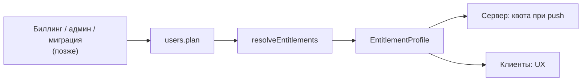

# ADR-0009: Тарифы как данные — entitlements, квоты, пилот

- Статус: принято (биллинг — отдельным решением позже)
- Дата: 2026-09-28
- Основание: [ADR-0005](0005-local-first-e2ee-architecture.md), Stage 5 и §11.2 (в документе владельца — «ADR-005»)
- Код: `packages/shared/src/entitlements.ts` (профили, резолвер, квоты `canCreateImpact` и `canStoreObjects`);
  сервер — `apps/api/src/modules/entitlements/*` (подсчёт использования — `usage.ts`), проверка квот в
  `apps/api/src/modules/sync/sync.service.ts`;
  клиент — `apps/web/src/composables/{useEntitlements,useImpacts}.ts`

## Контекст

Монетизация заложена в архитектуру с первого дня, но биллинга в пилоте нет. Нужно, чтобы включение
FREE/PRO потом не потребовало переписывать синхронизацию, клиенты и домен, а коммерческая политика не
касалась зашифрованного содержимого. Главный запрет ADR-0005: платный барьер не может закрыть доступ к
своим данным, ослабить шифрование, восстановление или экспорт.

## Решение

### 1. Профиль возможностей — данные, а не ветки в коде

```ts
EntitlementProfile {
  planId: 'PILOT' | 'FREE' | 'PRO'
  revision: number          // версия профиля
  effectiveFrom: string     // с какой даты действует
  limits: {                 // null — без ограничения
    maxActiveImpacts, maxAttachmentBytes, maxDevices,
    maxStorageBytes,        // сумма байт шифротекстов объектов синхронизации на сервере
    maxObjects              // живые объекты синхронизации на сервере (tombstone'ы не считаются)
  }
  capabilities: {
    encryptedSync, multiDevice, attachments, advancedAnalytics, reviewBuilder,
    localAI, cloudAI, chromeCapture, cliCapture, vscodeCapture
  }
}
```

Профили лежат в одном месте — `PLAN_PROFILES` в `packages/shared` — и одинаково используются сервером и
всеми клиентами. Никаких `if (pilot)`: пилот — просто ещё один профиль.

| | PILOT | FREE | PRO |
| --- | --- | --- | --- |
| `maxActiveImpacts` | без ограничения | **15** | без ограничения |
| `maxAttachmentBytes` | без ограничения | 50 МиБ | 5 ГиБ |
| `maxDevices` | без ограничения | 2 | без ограничения |
| `maxStorageBytes` | **512 МиБ** | 50 МиБ | 5 ГиБ |
| `maxObjects` | **100 000** | 1 000 | 1 000 000 |
| `advancedAnalytics` | да | нет | да |
| `localAI` | да | нет | да |
| `cloudAI` | нет | нет | нет |
| Остальные capabilities (`encryptedSync`, `multiDevice`, `attachments`, `reviewBuilder`, `chromeCapture`, `cliCapture`, `vscodeCapture`) | да | да | да |
| `revision` / `effectiveFrom` | 2 / 2026-09-29 | 2 / 2026-09-29 | 2 / 2026-09-29 |

FREE и PRO — черновик для экспериментов: числа и набор возможностей — не архитектурные константы
(ADR-0005). `cloudAI` выключен везде, пока нет отдельного решения по облачному AI. Лимиты хранилища есть
**даже у PILOT**: это не тариф, а потолок против злоупотреблений (раздувание хранилища одним аккаунтом);
обычный журнал до него не дорастает. Ревизия 2 профилей — появление `maxStorageBytes` и `maxObjects`.

### 2. Резолвер

`resolveEntitlements(commercialState) → EntitlementProfile`, где `CommercialState = { planId }`.
Коммерческое состояние видно серверу (`users.plan`, по умолчанию `PILOT`) и логически отделено от
зашифрованного контента. Будущий биллинг будет менять только коммерческое состояние; резолвер превращает
его в профиль, а шифротексты, ключи и расшифрованная аналитика через биллинг не проходят.



- **Сервер:** `GET /api/entitlements` → `{ plan, profile, usage: { activeImpacts, devices, storageBytes,
  objects } }`.
- **Web-клиент:** без аккаунта — профиль `DEFAULT_PLAN` (`PILOT`); с аккаунтом — профиль с сервера
  (`useEntitlements().setProfile`). Экраны не знают про тарифы: только `profile.limits` и
  `can(capability)`.

### 3. Квота активных записей

`canCreateImpact(profile, activeImpacts)`:

- ограничивает **только создание** новой записи; чтение, правка, удаление и экспорт существующих — всегда;
- считает **активные** (не удалённые) записи, а не «создано за всё время» — удаление освобождает место;
- ответ: `{ allowed: true }` или `{ allowed: false, reason: 'ACTIVE_IMPACT_LIMIT', limit }`.

Для FREE это 15 активных записей: 16-я не создаётся, пока одна из 15 не удалена или тариф не сменился;
все 15 при этом читаются, правятся, удаляются и экспортируются.

### 3a. Квоты серверного хранилища

`canStoreObjects(profile, usage, { addBytes, addObjects })`, где `usage = { storageBytes, objects }`:

- `maxStorageBytes` — сумма `octet_length(ciphertext)` всех объектов пользователя;
- `maxObjects` — число **живых** объектов; tombstone'ы не считаются (удаление освобождает место — квота по активным данным, ADR-0005);
- ограничивается **только рост**: новая строка (`addObjects > 0`) или больше байт (`addBytes > 0`).
  Уменьшение и удаление разрешены всегда, даже когда лимит уже превышен (например, после смены тарифа);
- ответ: `{ allowed: true }` или `{ allowed: false, reason: 'STORAGE_LIMIT' | 'OBJECT_LIMIT', limit }`.

Эти квоты защищают ресурсы сервера, а не «количество записей» как продуктовую ценность, поэтому они в
первую очередь — ограничение против злоупотреблений.

### 4. Где применяется

| Уровень | Что проверяется | Зачем |
| --- | --- | --- |
| Сервер, push (`sync.service.ts`) | `maxActiveImpacts` при создании объекта `impact` (новый объект или «воскрешение» tombstone'а); `maxStorageBytes` и `maxObjects` при росте хранилища; результат `rejected QUOTA_EXCEEDED` для конкретного изменения | Авторитетная проверка: клиентским флагам не доверяем (ADR-0005) |
| Клиент, `useImpacts().create` | тот же `canCreateImpact` по числу локальных записей → `QuotaExceededError` | UX: не дать создать запись, которую сервер отвергнет |

Серверная проверка не расшифровывает ничего: считает строки `objects` (с `kind = 'impact'` и
`deleted = false` — для активных записей; все строки и сумму `octet_length` — для хранилища). Счётчики
считаются один раз за push и ведутся по ходу, под блокировкой строки пользователя. Гонки офлайн-клиентов закрывает сервер: пуши пользователя сериализованы (ADR-0007), а
запись, отвергнутая по квоте, остаётся на устройстве и не теряется.

Сейчас на сервере применяются `maxActiveImpacts`, `maxStorageBytes` и `maxObjects`. `maxDevices`,
`maxAttachmentBytes` и все capabilities — информация для клиента; клиенты захвата профиль не читают вовсе (у них нет аккаунта,
ADR-0010). Импорт собственного экспорта на клиенте квотой не ограничивается (перенос своих данных), но при
синхронизации новые объекты сверх квоты сервер отвергнет — для FREE это нужно будет показать в UX.

### 5. Что никогда не бывает платным

- шифрование (локальное хранилище, E2EE, синхронизация как защищённое хранение своих данных);
- восстановление (Recovery Key, смена пароля, TOTP);
- экспорт (JSON/CSV/Markdown — `packages/core/src/report/*`) и доступ к уже созданным данным;
- удаление аккаунта и данных.

Истечение подписки меняет будущие возможности, но не владение данными. Инвариант проверяет тест
`packages/core/test/domain.test.ts` («безопасность и экспорт не бывают платными»: синхронизация и review
builder включены на FREE). На 2026-09-28 блок Entitlements в этом тесте падает: он импортирует
`resolveEntitlements` и `PLAN_PROFILES` из `@impact-log/core`, а они живут в `@impact-log/shared`.

### 6. Пилот

Все новые аккаунты и локальные хранилища получают `PILOT` — без ограничений, но через тот же резолвер и те
же проверки, что будут у FREE/PRO. Фальшивых клиентских лимитов «для проверки» нет; границы проверяются
тестами на профилях FREE. Перед переводом пилотных аккаунтов на FREE/PRO нужна явная политика миграции —
молча ограничивать нельзя.

## Последствия

- (+) Включение тарифов — смена данных (`PLAN_PROFILES`, `users.plan`), а не кода синхронизации и домена.
- (+) Сервер применяет квоту без доступа к содержимому.
- (−) Изменения тарифа не аудируются: есть `revision` у профиля, но истории смен `users.plan` нет.
  ADR-0005 требует «auditable/versioned» — нужно до подключения биллинга.
- (−) Профили зашиты в код `packages/shared`: смена чисел требует релиза всех клиентов. Когда появится
  биллинг, профиль должен приходить с сервера (он уже приходит в `GET /api/entitlements`), а константы в
  shared — остаться значениями по умолчанию.
- (−) Лимиты устройств и вложений пока не применяются на сервере.
- (+) `maxObjects` считает только живые объекты: удаление освобождает место, как требует ADR-0005. Tombstone'ы без компакции
  копятся, но их число ограничено числом удалений (tombstone «из ничего» сервер отклоняет) — компакция остаётся TODO.
- (−) Лимиты хранилища на клиенте в UX пока не проверяются заранее: запись, не принятая по квоте, остаётся
  на устройстве и видна как «не отправлена из-за лимита» (ADR-0007).

## Альтернативы

- **Проверки `if (plan === 'PRO')` по коду** — запрещено ADR-0005: политика расползается по клиентам.
- **Квота по «создано за всё время»** — наказывает за удаление, делает бесплатный тариф всё менее
  пригодным (ADR-0005).
- **Блокировка чтения при превышении** — «данные в заложниках», прямо запрещено.
- **Только клиентская проверка** — клиенту нельзя доверять; квота, защищающая тариф, обязана быть на
  сервере.
