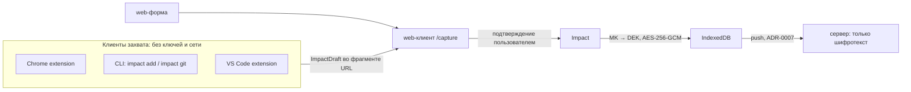

# ADR-0010: Протокол захвата — ImpactDraft и передача черновика в web-клиент

- Статус: принято
- Дата: 2026-09-28
- Основание: [ADR-0005](0005-local-first-e2ee-architecture.md), §11.1 (в документе владельца — «ADR-009»)
- Код: `packages/core/src/capture/draft.ts`, `packages/core/src/domain/{evidence,impact}.ts`; клиенты —
  `apps/chrome-extension`, `apps/cli`, `apps/vscode-extension` (их README), приём — маршрут `/capture`
  web-клиента (`apps/web/src/router/index.ts`, `views/CaptureView`, `utils/captureHandoff.ts`)

## Контекст

Записывать impact удобнее там, где работа уже происходит: в браузере на странице PR или задачи, в
терминале после коммита, в редакторе. ADR-0005 ограничивает набор клиентов Web/PWA, Chrome, CLI и VS Code
и требует, чтобы все они производили один версионированный черновик. Отдельный вопрос — ключи: без
десктоп-агента каждый клиент, который пишет в хранилище сам, должен стать отдельным устройством со своим
конвертом и секретным хранилищем (keychain, SecretStorage). Это много поверхности атаки ради быстрой
заметки.

## Решение

### 1. ImpactDraft v1

```ts
ImpactDraft {
  schemaVersion: 1                 // DRAFT_SCHEMA_VERSION, версионируется отдельно от UI
  draftId: UUID
  title?: string                   // ≤ 200
  description?: string            // Markdown, ≤ 20 000
  impactScore?: 1 | 2 | 3 | 4 | 5
  occurredAt?: 'YYYY-MM-DD'        // дополнение к схеме ADR-0005
  categories?: string[]            // ≤ 10 × 40
  labels?: string[]                // ≤ 20 × 40
  metrics?: Metric[]               // ≤ 10: { label, value, unit?, baseline? }
  evidence?: Evidence[]            // ≤ 20
  attachments?: AttachmentRef[]    // ≤ 50, точка расширения
  source?: { type: 'web' | 'chrome' | 'cli' | 'vscode', uri?: string, externalRef?: string }
}

Evidence {
  kind: 'url' | 'pr' | 'issue' | 'commit' | 'branch' | 'doc' | 'text'
  url?: string        // ≤ 2000
  title?: string      // ≤ 300
  ref?: string        // номер PR, ключ задачи, SHA; ≤ 200
  excerpt?: string    // выделенный текст — только если пользователь явно выбрал; ≤ 4000
}
```

- Схема — `impactDraftSchema` (zod) в core; все клиенты собирают черновик через неё (`createDraft` /
  `makeDraft`), web-клиент проверяет её же при приёме.
- Черновик — ещё не история: web-клиент превращает его в поля формы (`draftToImpactInput`: оценка по
  умолчанию 3, дата по умолчанию — сегодня, нормализация меток и категорий), пользователь правит и
  подтверждает, только после этого создаётся `Impact`.
- `Evidence` отделено от описания: это «откуда видно», а не «что сделал». `evidenceFromUrl` распознаёт PR
  и merge request, коммит, задачу Jira и issue, документ (Google Docs, Notion, Confluence, wiki).
- `evidence` добавлено и в сам `Impact` (схема ADR-0005 §7 его не содержала).

### 2. Handoff через фрагмент URL

```text
<app-url>/capture#draft=<base64url(JSON черновика)>
```

- `buildCaptureUrl(appOrigin, draft)` / `readDraftFromHash(hash)`; путь — `CAPTURE_PATH = '/capture'`.
- Черновик лежит **во фрагменте** (после `#`): браузер не отправляет фрагмент на сервер, он не попадает ни в
  логи Caddy, ни в API. Но это всё равно адрес страницы: черновик видит браузер пользователя, и он живёт
  там по правилам URL (см. «Где черновик может остаться» ниже).
- **Лимит длины:** `MAX_HANDOFF_LENGTH = 16 000` символов на весь URL при сборке и на закодированный черновик
  при разборе. Клиенты захвата не молча обрезают: CLI просит сократить описание, Chrome и VS Code ужимают
  цитату (`excerpt`) и сообщают об этом.
- Разбор терпит мусор: неверный base64url, JSON или схема → `null`, форма открывается пустой.
- Маршрут `/capture` доступен без аккаунта и без хранилища (`access: 'any'`): черновик не должен теряться
  у пользователя, который ещё не создал локальное хранилище.
- Требование к web-клиенту: сразу после чтения черновика убрать фрагмент из адресной строки и текущей
  записи истории — `history.replaceState` и затем `router.replace({ path, hash: '' })`
  (`apps/web/src/utils/captureHandoff.ts`). Второй шаг обязателен: без него vue-router продолжает считать
  текущим адресом `/capture#draft=…` (`route.fullPath`, `route.hash`), и черновик мог утечь туда, где
  адрес текущей страницы используется дальше.
- Ни фрагмент, ни пользовательский текст не переносятся в `redirect` входа: адрес «вернуться после входа»
  строится из `route.path` и разрешённых параметров периода (`redirectTarget`,
  `apps/web/src/utils/navigation.ts`), а `safeRedirect` отвергает значения с `#`, `\` и пробелами.
  Иначе черновик оказался бы в query `/login?redirect=…` — а query, в отличие от фрагмента, уходит на
  сервер при загрузке страницы и попадает в access-лог.

#### Где черновик может остаться

Честно: черновик проходит через адрес страницы, поэтому до и помимо очистки он может сохраниться там, где
браузер хранит адреса:

- в **истории посещений** браузера (и в её синхронизации между устройствами, если она включена в профиле
  браузера), в подсказках адресной строки: браузер записывает открытый адрес раньше, чем приложение успевает
  его заменить; `replaceState` меняет только текущую запись истории сессии;
- у клиента, который открыл ссылку: в терминале/логе CLI (если адрес печатается — `--print`), в
  командной строке процесса, которым открывается браузер;
- у расширений браузера с доступом к вкладкам или истории.

Поэтому в черновик попадает только то, что пользователь явно выбрал (§4), а лимит длины ограничивает
объём.

#### Черновик во время онбординга

Если на устройстве ещё нет хранилища (или пользователь уходит входить в аккаунт), черновик держится в
памяти вкладки и в `sessionStorage` этой вкладки (`impact-log:capture-draft`) — открытым текстом, на
устройстве пользователя. Он удаляется после сохранения записи или отмены; `sessionStorage` живёт до
закрытия вкладки. Вход из `/capture` возвращает на `/capture` без черновика в адресе (он читается из
`sessionStorage`).

### 3. Клиенты захвата не держат ключей

Решение для «Key ownership without a desktop agent» (ADR-0005 §11.1): Chrome, CLI и VS Code **не ходят в
API, не имеют аккаунта, сессии и ключей**. Они собирают `ImpactDraft` и открывают web-клиент; шифрует и
сохраняет запись web-клиент — единственное устройство с MK на этой машине. ADR-0005 это допускает («If a
runtime cannot safely retain an unlock capability, require explicit unlock/pairing rather than weakening the
vault»), здесь роль «явной разблокировки» играет подтверждение в браузере.



| Клиент | Как захватывает | Приватность |
| --- | --- | --- |
| Web / PWA | Форма записи; принимает черновики на `/capture` | Канонический клиент: хранилище, аналитика, отчёты, восстановление, устройства, синхронизация |
| Chrome (MV3) | Окно расширения (`Alt+Shift+I`): заголовок вкладки без «хвостов», URL с распознаванием типа, выделенный текст; контекстное меню «Сохранить страницу / выделенное / ссылку»; настройки — адрес impact log и оценка по умолчанию | Разрешения ровно `activeTab`, `contextMenus`, `scripting`, `storage`; нет `host_permissions`, нет сетевых запросов; страница целиком не читается; только `http(s)`-адреса; незаконченный черновик — в `chrome.storage.session` (память) |
| CLI (`impact`) | `impact add` (флаги или интерактивно, описание из stdin), `impact git` (коммит → заголовок, описание, evidence коммита и ветки), `impact decode` (что лежит в ссылке), `impact config`; `--print`, `--json`, `--no-open`; коды выхода 0 / 1 (ввод) / 2 (прочее) | Никаких сетевых запросов и телеметрии; только открывает браузер; логин/токен из https-remote в ссылки не попадает; конфиг `~/.config/impact-log/config.json` с правами 600 |
| VS Code | Команды «Capture impact», «Capture selection» (цитата + постоянная ссылка на строки), «Capture last commit» | Нет сети и телеметрии; git вызывается локально без shell и не запускается в Restricted Mode; `impactLog.appUrl` — только пользовательская настройка (рабочая область не может перенаправить черновики) |

Адрес приложения во всех клиентах настраивается (по умолчанию `https://impact-log.com`), разрешён только
`https://`, для localhost — и `http://`.

### 4. Что захватывается

Только то, что пользователь явно выбрал: текущая вкладка после клика, выделенный текст, конкретный коммит.
Никакого фонового сбора коммитов, PR, задач или истории браузера (ADR-0005, non-goals). Продукт хранит
impact, а не сырую активность.

## Последствия

- (+) Минимальная поверхность атаки: у клиентов захвата нет секретов, их компрометация не раскрывает
  хранилище, а подсунутый черновик не станет записью без подтверждения.
- (+) Один контракт (`impactDraftSchema`) для всех клиентов, схема проверяется на обеих сторонах.
- (+) Не нужны per-client enrollment, keychain и SecretStorage, отзыв клиентов захвата не нужен.
- (−) Захват требует браузера с открытым impact log: из CLI или VS Code без браузера запись не создать,
  офлайн-очереди черновиков нет.
- (−) Черновик проходит через адрес страницы: ссылка с ним может остаться в истории посещений браузера
  (и в её синхронизации), в подсказках адресной строки, у расширений с доступом к вкладкам — очистка
  адреса в web-клиенте это не отменяет. Во время онбординга черновик лежит открытым текстом в
  `sessionStorage` вкладки. Лимит 16 000 символов ограничивает объём описания и цитат.
- (−) Capabilities `chromeCapture`, `cliCapture`, `vscodeCapture` (ADR-0009) сейчас ничем не проверяются —
  клиенты захвата не знают тарифа. Если понадобится ограничение, проверять его будет web-клиент при приёме.
- (−) Адаптеров под конкретные сайты (Jira, Grafana и т.п.) нет — только общий захват вкладки и
  распознавание типа ссылки.

## Альтернативы

- **Каждый клиент — отдельное устройство с конвертом MK** (текст ADR-0005): полноценная запись офлайн и без
  браузера, но keychain/SecretStorage/хранилище расширения, модель угроз на каждый рантайм и
  per-client-отзыв. Отложено, пока handoff достаточно.
- **Черновик в query-строке или через API** — попадает на сервер и в логи, противоречит E2EE.
- **Локальный демон / localhost API** — явно вне рамок ADR-0005.
- **`postMessage` / native messaging между расширением и вкладкой** — только для Chrome, сложнее; фрагмент
  URL одинаково работает для всех трёх клиентов.
