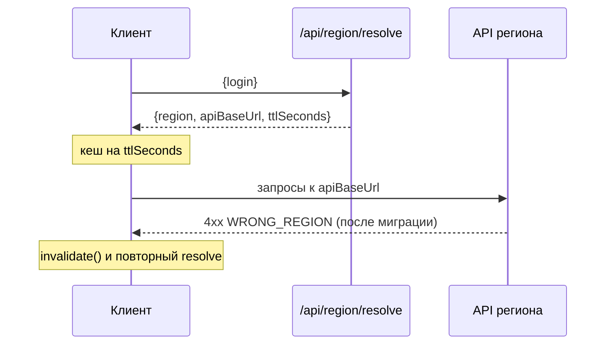

# ADR-0011: Готовность к регионам — Account ID и резолвинг endpoint

- Статус: принято (только «regional-ready»; второй регион и миграция — отдельным ADR, когда понадобятся)
- Дата: 2026-09-28
- Основание: [ADR-0005](0005-local-first-e2ee-architecture.md), §11.3 (в документе владельца — «ADR-010»)
- Код: `packages/core/src/region/index.ts` (кеш резолвинга, формат Account ID),
  `packages/shared/src/schemas/account.ts` (`regionResolve*`), `apps/api/src/modules/region/region.routes.ts`,
  `apps/api/src/lib/crypto.ts` (`generateAccountId`), `apps/api/src/config.ts` (`REGION`, `PUBLIC_API_BASE_URL`)

## Контекст

Пилот работает в одном регионе (VPS в Москве). ADR-0005 требует, чтобы уже сейчас ничто не мешало потом
разнести хранилища по региональным data plane (RU, EU) и переносить зашифрованное хранилище между ними без
расшифровки и без смены идентификатора аккаунта. Сам движок миграции не нужен, пока нет второго региона.

## Решение

### 1. Непрозрачный Account ID

- `accountId` — 12 символов Crockford Base32 из 60 случайных бит (`generateAccountId`, сервер), уникален
  (`users.account_id`), выдаётся при регистрации и не меняется никогда.
- **Регион не кодирует** и вообще ничего не кодирует: при миграции хранилища Account ID останется прежним.
- Для людей показывается группами по 4: `formatAccountId('7F82KL92PA71')` → `7F82-KL92-PA71`;
  `normalizeAccountId` убирает дефисы и пробелы.
- `objectId` объектов — случайные UUID клиента, тоже не зависят ни от сервера, ни от региона: шифротексты
  переносимы между регионами байт-в-байт (ADR-0007).

### 2. Резолвинг endpoint

`POST /api/region/resolve { login } → { region, apiBaseUrl, ttlSeconds }`

- Ответ — из конфигурации инстанса: `REGION` (по умолчанию `ru-1`) и `PUBLIC_API_BASE_URL` (по умолчанию
  `/api`: путь от origin приложения или абсолютный URL); `ttlSeconds = 3600`.
- Пока регион один, ответ **одинаков для любого логина**, в том числе несуществующего — по нему нельзя
  узнать, есть ли аккаунт. Лимит частоты 60 запросов за 5 минут с IP.
- Идентификатор региона — конфигурация развёртывания, а не доменная константа.

Клиентская сторона — `createEndpointResolver(resolve)` в core: кеширует ответ на `ttlSeconds`, метод
`invalidate()` сбрасывает кеш. По контракту клиент пере-резолвит endpoint, когда истёк TTL или сервер
ответил кодом `WRONG_REGION` (объявлен в `ERROR_CODES`).

### 3. Что сделано сейчас и что отложено

| Сделано | Отложено |
| --- | --- |
| Account ID без региона, объекты с переносимыми UUID | Глобальный control plane (Region Directory `accountId → region`) и хранение `homeRegion` у аккаунта |
| Ручка `/api/region/resolve` и конфиг `REGION`, `PUBLIC_API_BASE_URL` | Второй физический регион, выбор региона пользователем |
| Кеш и инвалидация в core (`createEndpointResolver`), код `WRONG_REGION` в контракте | Возврат `WRONG_REGION` сервером (сейчас не возвращается нигде) |
| Шифротексты и конверты переносимы без расшифровки | Движок миграции: состояния `ACTIVE_SOURCE → … → SOURCE_DELETED`, манифест и сверка хешей, барьер записи, удаление в источнике и бэкапах |
| — | Подключение резолвера в web-клиенте: сейчас `apps/web/src/api/http.ts` ходит на same-origin `/api` |

Клиенты захвата (Chrome, CLI, VS Code) в API не ходят вообще (ADR-0010): им нужен только адрес
web-приложения, он настраивается и регион не кодирует.

### 4. Правила, которые действуют уже сейчас

- Не кодировать регион в Account ID, `objectId` и любых других идентификаторах.
- Не хардкодить адрес API в новом клиентском коде; новые обращения к API — через базовый URL, который можно
  получить из резолвера.
- Идентификаторы провайдеров хранения — за адаптерами, не в доменных данных.
- `UPDATE homeRegion` как обычное изменение аккаунта запрещено — только протокол миграции (когда появится).

## Последствия

- (+) Перенос хранилища между регионами не потребует ни смены Account ID, ни перешифровки.
- (+) Резолвинг не раскрывает существование аккаунта.
- (−) **Отличие от ADR-0005:** резолвинг по логину, а не по Account ID (логин — идентификатор входа,
  ADR-0008). Для второго региона понадобится глобальная карта `login → region` (или `accountId → region` с
  поиском по логину) — логин тогда станет частью control plane, это стоит учесть в ADR о миграции.
- (−) Когда регионов станет больше одного, «одинаковый ответ для всех логинов» перестанет быть
  бесплатным: придётся решать, что отвечать на несуществующий логин (например, регион по умолчанию).
- (−) CSP web-клиента (`connect-src 'self'`, `infra/caddy/Caddyfile`) не пустит запросы на абсолютный
  `apiBaseUrl` другого домена — при появлении регионов на отдельных доменах CSP нужно расширять.

## Альтернативы

- **Регион в идентификаторе** (`eu-…`) — запрещено ADR-0005: миграция меняла бы ID.
- **Резолвинг по IP / геолокации** — `homeRegion` не должен зависеть от поездок и VPN (ADR-0005).
- **Сразу строить control plane и миграцию** — преждевременно, пока регион один (ADR-0005, «Pilot
  behavior»).
