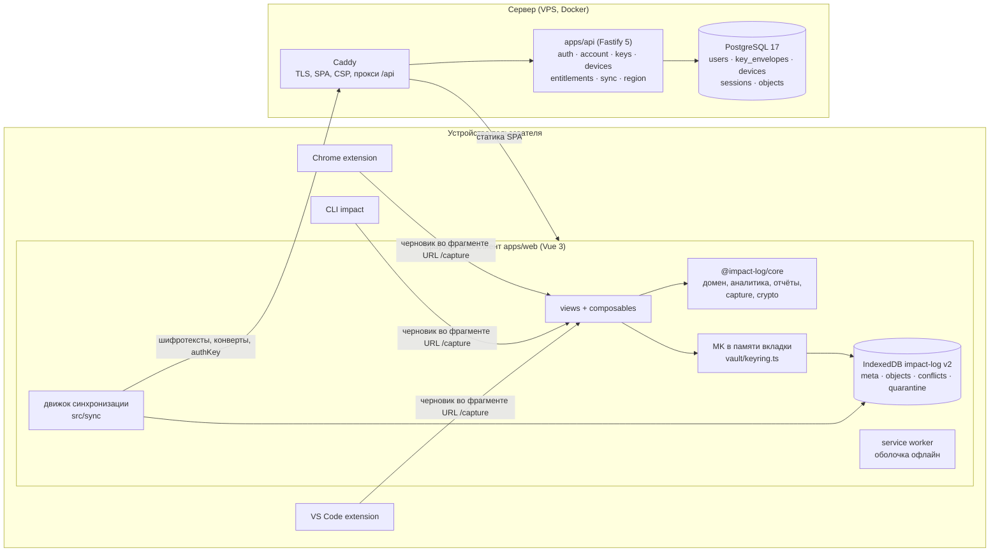
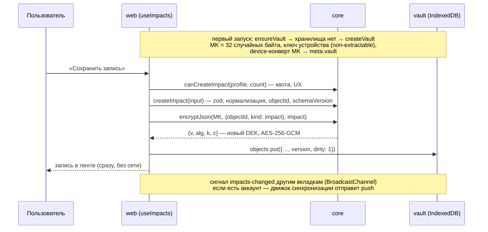
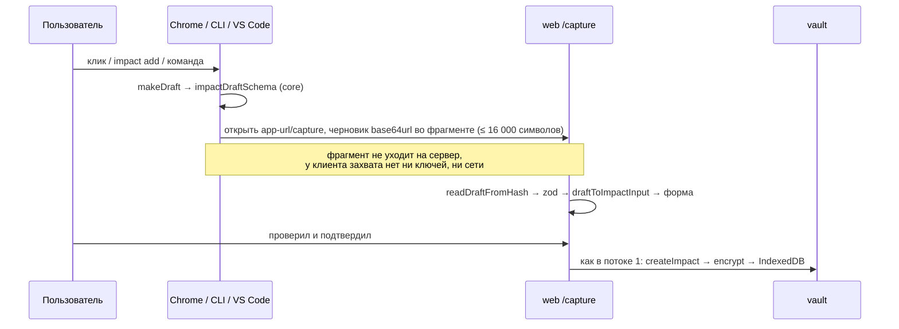

# Архитектура impact log

Обзор для нового разработчика: из чего состоит система, куда текут данные и где что лежит в коде.
Решения и их обоснования — в ADR (`docs/adr`), контракты HTTP — в [docs/api.md](api.md), UI —
в [docs/design-system.md](design-system.md), PWA и офлайн — в [docs/pwa.md](pwa.md), деплой — в
[docs/deploy.md](deploy.md). Состояние — на 2026-09-29: local-first + E2EE после двух раундов усиления
безопасности.

## Главное в трёх абзацах

impact log — личный журнал рабочих достижений: что сделал, какой эффект, насколько это важно (1–5); к
перфоманс-ревью — выжимка за период. Записи могут содержать конфиденциальное о работодателе, поэтому
продукт **local-first и со сквозным шифрованием** ([ADR-0005](adr/0005-local-first-e2ee-architecture.md)):
домен, открытый текст, аналитика и отчёты живут только на клиенте.

Web-клиент при первом запуске создаёт на устройстве хранилище (vault): случайный Master Key (MK), ключ
устройства и IndexedDB с зашифрованными записями. Регистрация не нужна, чтобы начать, а после первого
открытия приложение работает и без сети: это PWA, service worker хранит оболочку приложения (но не данные,
[docs/pwa.md](pwa.md)). Аккаунт — опциональное подключение синхронизации между устройствами; сервер при
этом хранит только шифротексты, ключевые конверты, устройства, сессии и тариф.

Chrome-расширение, CLI и расширение VS Code — «быстрый захват»: они не держат ключей и не ходят в API, а
передают черновик записи в web-клиент через фрагмент URL.

## Схема системы



Что видит сервер и чего не видит:

| Сервер видит | Сервер не видит |
| --- | --- |
| логин, `accountId`, тариф, TOTP-секрет (зашифрован ключом из env) | пароль (приходит `authKey`), MK, DEK, Recovery Key |
| хеш `authKey`, SHA-256 от `recoveryAuthKey`, секрета устройства и trust-токена | сами эти значения |
| конверты MK `password` и `recovery` (непрозрачные строки) | device-конверт и ключ устройства (только на устройстве) |
| объекты: `objectId`, вид, версия, размер, время, `seq`, флаг удаления | заголовки, описания, оценки, метки, категории, метрики, даты событий, evidence |
| устройства: зашифрованное название, `last_seen_at`, доверие, отзыв | черновики из клиентов захвата (они во фрагменте URL) |
| усечённые IP в логах, объём и время синхронизации | аналитику и отчёты (считаются на клиенте) |

## Пакеты монорепо

pnpm workspaces, TypeScript strict, Biome ([ADR-0002](adr/0002-stack.md)).

| Путь | Пакет | Роль | Зависит от |
| --- | --- | --- | --- |
| `packages/core` | `@impact-log/core` | Ядро продукта на чистом TS (браузер и Node): домен (`Impact`, `Evidence`, `Metric`, `AttachmentRef`, метки), миграции схемы, `ImpactDraft` и handoff, детерминированная аналитика, отчёт для ревью и экспорт, интерфейс `ImpactRepository`, регион-хелперы; отдельный вход `@impact-log/core/crypto` — вся криптография. Тесты — vitest | `zod`, `hash-wasm` |
| `packages/shared` | `@impact-log/shared` | Контракт клиент ↔ API: zod-схемы запросов и ответов (`schemas/auth`, `account`, `sync`, `health`), коды ошибок, entitlements (профили тарифов, резолвер, квота) | `zod` |
| `apps/api` | `@impact-log/api` | HTTP API: Fastify 5 + Drizzle + PostgreSQL 17; аутентификация, конверты, устройства, синхронизация, тарифы, регион | shared |
| `apps/web` | `@impact-log/web` | Канонический клиент: Vue 3 + Vite + vue-router + vue-i18n; хранилище в IndexedDB (`idb`), Markdown (`marked` + DOMPurify), экраны записей, аналитики, ревью, настроек, входа и восстановления | core, shared |
| `apps/cli` | `@impact-log/cli` | Команда `impact`: `add`, `git`, `decode`, `config`; собирает черновик и открывает браузер | core |
| `apps/chrome-extension` | `@impact-log/chrome-extension` | Расширение Manifest V3: окно, контекстное меню, настройки | core |
| `apps/vscode-extension` | `impact-log-vscode` | Команды «Capture impact / selection / last commit» | core |

Правило зависимостей: `core` не знает про HTTP и Vue, `shared` не знает про криптографию, `api` не
импортирует `core` (сервер ничего не расшифровывает), клиенты захвата используют только `core`.

## Потоки данных

### 1. Первый запуск и запись офлайн



При следующих запусках `loadVault()` читает ключ устройства и device-конверт и разворачивает MK без
пароля. Лента, поиск, аналитика и отчёты работают над расшифрованным `Impact[]` в памяти
(`packages/core/src/analytics`, `report`).

Устройство хранилища (IndexedDB `impact-log`, версия схемы 2, `apps/web/src/vault/db.ts`):

| Store | Что лежит |
| --- | --- |
| `meta` | `vault` — запись хранилища: device-конверт MK, **отпечаток MK** `mkId`, привязка аккаунта (`userId`, `accountId`, `login`, `deviceId`, `deviceSecret`), `kdfPin` (TOFU параметров KDF); `deviceKey` — неэкспортируемый ключ устройства; `sync` — курсор и время синхронизации |
| `objects` | зашифрованные объекты (формат v1, ADR-0006) с `version`, `dirty`, `deleted` |
| `conflicts` | серверные ветки неразрешённых конфликтов (ADR-0007) |
| `quarantine` | объекты, которые не удалось расшифровать при смене MK: лежат как есть, только на этом устройстве, в синхронизацию не попадают (появился в версии 2 схемы) |

Отпечаток MK — первые 16 байт `HMAC-SHA256(MK, "impact-log/v1/mk-id")`. Каждая транзакция записи сверяет
его с отпечатком MK, открытого во вкладке: если другая вкладка тем временем сменила MK (вошла в аккаунт),
запись старым ключом отклоняется (`VAULT_CHANGED`) и вкладка перезагружается. Смена MK — одна транзакция
под Web Lock `impact-log:rekey` ([ADR-0006](adr/0006-crypto.md) §8).

### 2. Синхронизация

Движок (`apps/web/src/sync`) в одной вкладке (Web Lock) по триггерам — вход, локальные изменения, фокус,
`online`, раз в минуту — делает цикл: pull с курсора (`GET /api/sync/pull?cursor=`) → push объектов с
`dirty = 1` и их `baseVersion` (`POST /api/sync/push`) → повторный pull при конфликтах. Каждый запрос несёт
заголовок `X-Impact-Account` с Account ID хранилища: если cookie сессии принадлежит другому аккаунту,
сервер отвечает `409 ACCOUNT_MISMATCH`, и синхронизация останавливается, не смешивая данные. Сервер
отвечает по каждому изменению: `accepted` (новая версия), `conflict` (серверная ветка — клиент хранит обе,
пользователь выбирает «моя / с сервера / обе»), `rejected` (`QUOTA_EXCEEDED` — лимиты тарифа и хранилища,
`INVALID`). Лимит частоты — на пользователя. Подробно — [ADR-0007](adr/0007-sync.md).

### 3. Подключение синхронизации (регистрация)

Клиент генерирует новый MK аккаунта, выводит из пароля KEK и `authKey` (Argon2id в Web Worker → HKDF),
делает password-конверт, Recovery Key и recovery-конверт → пользователь сохраняет Recovery Kit и
подтверждает это → `POST /api/auth/register` → QR для TOTP → `POST /api/auth/register/confirm` → полная
сессия, `deviceId` и `deviceSecret` → только теперь локальные записи переоборачиваются под новый MK, а
хранилище привязывается к аккаунту → первый push всех записей. [ADR-0008](adr/0008-auth-devices.md) §6.

### 4. Вход на новом устройстве

`prelogin` (соль и параметры KDF; клиент проверяет потолок параметров и сверяет их с запомненными на
этом устройстве — TOFU) → синхронизация прежней сессии останавливается → Argon2id → `login` с `authKey`
(и `deviceId` + `deviceSecret`, если устройство уже было в этом аккаунте) → код TOTP (`login/verify`; с
доверенного устройства не нужен) → `GET /api/keys` → KEK открывает password-конверт → MK → на устройстве
создаётся хранилище под этим MK, а если там есть записи другого хранилища — пользователь выбирает в
диалоге: добавить их в аккаунт, стереть или отменить вход (`adoptMasterKey`) → pull с курсора 0 и
расшифровка. Пароль на сервер не уходит. [ADR-0008](adr/0008-auth-devices.md) §7.

### 5. Восстановление

Recovery Key (`ILRK1-…`) + ещё один фактор ([ADR-0008](adr/0008-auth-devices.md) §8):

- **Забыл пароль** (`/recover`): логин + Recovery Key → клиент проверяет контрольную сумму и выводит
  `recoveryAuthKey` → `POST /api/auth/recovery/begin` (конверт ещё не выдаётся) → код 2FA
  `POST /api/auth/recovery/verify` → recovery-конверт → Recovery KEK разворачивает MK локально → новый пароль
  и новый password-конверт того же MK → `POST /api/auth/recovery/complete` → прочие сессии и доверие устройств
  сброшены → pull.
- **Потерял телефон** (вход): пароль → на шаге 2FA Recovery Key вместо кода `POST /api/auth/login/recovery-key`
  → новая 2FA → `POST /api/auth/login/totp-reset` → обычное завершение входа.
- **Потерял всё** (`/recover`): begin → `POST /api/auth/recovery/delay` запускает отсчёт 48 часов; всё это время
  вошедшие устройства видят предупреждение (`GET /api/auth/me` → `recoveryPending`) и могут отменить
  (`POST /api/account/recovery/cancel`) → после срока begin → `POST /api/auth/recovery/resume` → конверт → новый
  пароль → обязательная новая 2FA (сессия помечена via_recovery).

[ADR-0006](adr/0006-crypto.md) §6.

### 6. Захват из расширения, CLI или VS Code



Приём черновика — `views/CaptureView` и `utils/captureHandoff.ts` (фрагмент сразу убирается из адреса).
[ADR-0010](adr/0010-capture-protocol.md).

## Где что лежит в коде

| Что | Где |
| --- | --- |
| Доменная модель `Impact`, валидация, миграции `schemaVersion` | `packages/core/src/domain/impact.ts` (+ `evidence.ts`, `metric.ts`, `attachment.ts`, `labels.ts`) |
| Черновик и handoff `#draft=` | `packages/core/src/capture/draft.ts` |
| Аналитика (сводка, распределения, тренды, сравнение периодов, серия недель, поиск) | `packages/core/src/analytics/*` |
| Отчёт для ревью (Markdown), экспорт/импорт JSON, CSV | `packages/core/src/report/*` |
| Криптография: AEAD, KDF, конверты, Recovery Key, объекты, иерархия ключей | `packages/core/src/crypto/*`, тесты `packages/core/test/crypto.test.ts` |
| Интерфейс хранилища записей | `packages/core/src/repository/index.ts` |
| Account ID, кеш резолвинга региона | `packages/core/src/region/index.ts` |
| Контракты API, коды ошибок, тарифы | `packages/shared/src/{schemas/*,errors.ts,entitlements.ts}` |
| Хранилище устройства: IndexedDB (v2, с карантином), MK и его отпечаток в памяти, ключ устройства, смена MK, зашифрованный репозиторий | `apps/web/src/vault/*` |
| Состояние хранилища, записи, тариф, синхронизация, аккаунт (синглтоны, без Pinia) | `apps/web/src/composables/{useVault,useImpacts,useEntitlements,useSync,useAccount}.ts` |
| Криптографические флоу аккаунта: ключи из пароля (Web Worker, потолок и TOFU параметров KDF), конверты, Recovery Kit, названия устройств | `apps/web/src/account/*`; диалоги `components/{MergeDialog,KdfChangeDialog,RecoveryKit}` |
| PWA: service worker, обновления, офлайн-статус, манифест | `apps/web/src/pwa/*`, `apps/web/public/manifest.webmanifest` ([docs/pwa.md](pwa.md)) |
| Движок синхронизации и его среда выполнения | `apps/web/src/sync/{engine,runtime,idbStore,content}.ts`, транспорт `apps/web/src/api/sync.ts` |
| Маршруты и доступ (`vault` / `guest` / `any`) | `apps/web/src/router/index.ts` |
| HTTP-клиент | `apps/web/src/api/*` |
| Сигналы между вкладками | `apps/web/src/utils/vaultChannel.ts` |
| Схема БД и миграции | `apps/api/src/db/schema.ts`, `apps/api/drizzle/*.sql` (`0002_e2ee.sql` — переход на E2EE, `0003_hardening.sql` — секрет устройства, блокировка TOTP, `via_recovery`) |
| Модули API | `apps/api/src/modules/{auth,account,keys,devices,entitlements,sync,region}` |
| Сессии и cookie, CSRF | `apps/api/src/plugins/{session,csrf}.ts` |
| Лимиты частоты (по IP с IPv6 /64, по паре «логин + IP», по пользователю), логи без SQL-параметров | `apps/api/src/lib/{rateLimit,logging}.ts`, `apps/api/src/utils/ip.ts` |
| Серверная криптография (хеш `authKey`, TOTP v2, блокировка перебора TOTP, секрет устройства, токены, Account ID) | `apps/api/src/modules/auth/{authKey,totp,totpGuard,prelogin}.ts`, `apps/api/src/lib/crypto.ts` |
| E2E-проверки: API и движок синхронизации против настоящего API | `apps/api/scripts/e2e.mjs`, `apps/web/scripts/sync-e2e.ts` |
| Caddy: TLS, CSP, логи с усечёнными IP | `infra/caddy/Caddyfile` |

## Как запустить локально

Нужны Node 24 (`.nvmrc`), pnpm (`corepack enable`) и Docker.

```bash
pnpm install
pnpm db:up                                   # Postgres 17 в Docker на 127.0.0.1:5432
pnpm --filter @impact-log/api db:migrate     # схема БД (API сам миграции не применяет)
pnpm dev                                     # api → http://localhost:3000, web → http://localhost:5173 (проксирует /api)
```

Локально `.env` не нужен: API по умолчанию ходит в Postgres из `docker-compose.dev.yml`, ключ TOTP в dev —
нули (в prod `TOTP_ENCRYPTION_KEY` обязателен). Переменные окружения — [docs/api.md](api.md).

Проверки:

```bash
pnpm check                                   # Biome: линт + формат
pnpm typecheck
pnpm build
pnpm --filter @impact-log/core test          # vitest: домен, аналитика, криптография и тест-векторы Recovery Key
```

E2E-проверки — на чистой БД и при запущенном API с `TRUST_PROXY=true` (скрипты имитируют пользователей и
устройства с разных IP через `X-Forwarded-For`, иначе упрутся в лимиты частоты по IP):

```bash
# в отдельном терминале: API с доверием к X-Forwarded-For, лог — в файл (e2e проверит, что в нём нет секретов)
TRUST_PROXY=true pnpm --filter @impact-log/api dev > /tmp/api.log 2>&1

pnpm --filter @impact-log/api e2e                    # API: auth, устройства, квоты, sync; API_URL, DATABASE_URL, API_LOG_FILE
cd apps/web && ../api/node_modules/.bin/tsx scripts/sync-e2e.ts   # движок синхронизации: два «устройства» одного аккаунта
```

Оба скрипта меняют тариф и данные прямо в БД (`DATABASE_URL`, по умолчанию локальная). Если лог API не
пишется в `API_LOG_FILE` (по умолчанию `/tmp/api.log`), проверка логов пропускается.

PWA (service worker) работает только в production-сборке: `pnpm --filter @impact-log/web build` и
`pnpm --filter @impact-log/web preview` (http://localhost:4173), подробно — [docs/pwa.md](pwa.md).

Клиенты захвата (подробно — README каждого):

```bash
pnpm --filter @impact-log/cli build                  # apps/cli/dist/impact.js
pnpm --filter @impact-log/chrome-extension build     # apps/chrome-extension/dist → «Загрузить распакованное»
pnpm --filter impact-log-vscode build                # apps/vscode-extension/dist/extension.cjs
```

Для локальной разработки направьте их на dev-сервер: `impact config set app-url http://localhost:5173`,
в настройках расширения Chrome — адрес `http://localhost:5173`, в VS Code — `impactLog.appUrl`.

## Словарь

| Термин | Что это |
| --- | --- |
| Хранилище (vault) | IndexedDB `impact-log` на устройстве: зашифрованные объекты, конверт MK под ключом устройства, состояние синхронизации, карантин |
| Отпечаток MK (`mkId`) | 16 байт HMAC-SHA256 от MK: по нему запись проверяет, что хранилище всё ещё под тем же MK |
| Карантин | Объекты, которые не удалось расшифровать при смене MK; остаются только на устройстве |
| `deviceSecret` | Секрет устройства от сервера: без него `deviceId` при входе не переиспользуется |
| MK, Master Key | Случайный 256-битный ключ хранилища; не зависит от пароля |
| DEK | Одноразовый ключ одной версии объекта; обёрнут MK |
| KEK | Ключ из пароля (Argon2id → HKDF); открывает password-конверт |
| `authKey` | Второй ключ из пароля; уходит на сервер вместо пароля |
| Конверт (envelope) | MK, зашифрованный KEK / Recovery KEK / ключом устройства, плюс параметры KDF |
| Recovery Key | `ILRK1-…`, 160 случайных бит; восстанавливает и доступ, и данные |
| Объект | Зашифрованная единица синхронизации (`objectId`, `kind`, `version`, шифротекст) |
| Tombstone | Объект-удаление (`deleted`, шифротекста нет) |
| `seq` | Монотонный номер изменения на сервере — курсор pull |
| ImpactDraft | Черновик записи от клиента захвата; становится `Impact` после подтверждения |
| Entitlements | Профиль возможностей тарифа (PILOT / FREE / PRO): лимиты и capabilities |

## ADR

| ADR | О чём |
| --- | --- |
| [0001](adr/0001-auth-model.md) | Модель аутентификации (частично заменена ADR-0008) |
| [0002](adr/0002-stack.md) | Стек и структура кода |
| [0003](adr/0003-responsive-layout.md) | Адаптивность и сетка |
| [0004](adr/0004-design-system.md) | Дизайн-система |
| [0005](adr/0005-local-first-e2ee-architecture.md) | Local-first + E2EE: целевая архитектура (документ владельца) и отличия реализации |
| [0006](adr/0006-crypto.md) | Криптография: ключи, конверты, Recovery Key, модель угроз |
| [0007](adr/0007-sync.md) | Синхронизация зашифрованных объектов |
| [0008](adr/0008-auth-devices.md) | Аутентификация, восстановление, устройства, сессии |
| [0009](adr/0009-entitlements.md) | Тарифы как данные, квоты, пилот |
| [0010](adr/0010-capture-protocol.md) | Протокол захвата и клиенты Chrome / CLI / VS Code |
| [0011](adr/0011-region-ready.md) | Готовность к регионам: Account ID и резолвинг endpoint |
